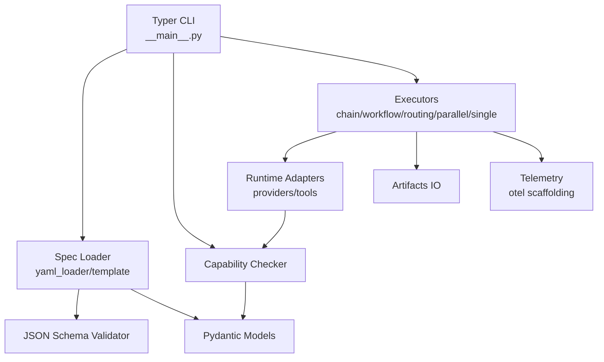

# Phase 3 Codebase Review

## Project structure at a glance
- Typer-based CLI entry point in `src/strands_cli/__main__.py` orchestrates validation, capability checks, and pattern-specific executors.
- Validation pipeline lives in `loader/` (YAML + templating) and `schema/` (JSON Schema) backed by strongly typed models in `types.py`.
- Execution strategies are decomposed into `exec/` modules (`single_agent`, `chain`, `workflow`, `routing`, `parallel`) working through runtime adapters and tool loaders in `runtime/`.
- Artifact emission, telemetry scaffolding, and capability reporting are isolated in `artifacts/`, `telemetry/`, and `capability/` respectively.
- Tests span unit, integration, and CLI coverage under `tests/`, with fixtures encapsulating supported/unsupported specs.

## Architecture & Design
**Strengths**
- Clear layering between spec ingestion, validation, capability analysis, and execution phases aligns with the planned three-phase model.
- Pattern-specific executors encapsulate orchestration logic per topology (sequential, DAG, routing, parallel), keeping the core CLI thin.
- Pydantic models and enums centralize schema semantics, easing cross-module reasoning and future expansion.

**Issues**
- 🟡 The `run` command in `__main__.py` (≈230 lines, flagged C901) acts as a monolith covering validation, capability branching, execution, and artifact handling. Extracting subcommands/services would improve extensibility for Phase 3 features (file: `src/strands_cli/__main__.py` lines 82-238).
- 🟢 Capability normalization still assumes a single "primary" agent (`capability/checker.py` lines 317-335). Although executors now pull agent IDs from steps, this legacy assumption can desync downstream consumers expecting `normalized.agent_id`.

## Code Quality
**Strengths**
- Consistent use of modern typing (`str | None`, `Annotated`) and strict mypy configuration keeps contracts explicit.
- Retry logic and budget tracking follow a uniform pattern across executors, enhancing readability.
- Rich/structlog integrations surface informative status while avoiding `print` calls.

**Issues**
- 🟡 Ruff reports seven C901 "too complex" violations (e.g., `run`, `plan`, `check_capability`, `run_chain`, `run_workflow`, `run_routing`, `load_spec`, `build_agent`). Refactoring into helper functions (input parsing, capability decision tree, retry config) would tame cyclomatic complexity and aid testability.
- 🟢 Duplicate retry helpers across executors (`_get_retry_config` in `single_agent.py`, `chain.py`, `workflow.py`, `parallel.py`) invite drift; consider a shared utility.

## Security
**Strengths**
- Python tool execution is limited via the `ALLOWED_PYTHON_CALLABLES` allowlist, reducing arbitrary import risk.
- Secrets are constrained to `source: env`, preventing surprise integrations with unmanaged secret stores in Phase 3.

**Issues**
- 🔥 Unsafe templating: `render_template` builds a default Jinja2 environment without sandboxing (`loader/template.py` lines 113-171). Because workflow specs are user-editable, attackers can craft templates like `{{ ''.__class__.__mro__[1].__subclasses__() }}` to traverse Python internals, leading to remote code execution. StrictUndefined alone is insufficient; a sandboxed environment or custom renderer is required.
- 🟡 SSRF/data exfiltration risk: `HttpExecutorAdapter` accepts arbitrary `base_url` from specs and exposes a generic `method/path` surface (`runtime/tools.py` lines 66-132). Without allowlists or network policy, a hostile spec can pivot the runner to internal services.
- 🟡 Path traversal/overwrite: Unsupported-feature reports use `Path(out) / f"{spec.name}-unsupported.md"` (`__main__.py` line 144). Crafted spec names (e.g., `../overrides/hosts`) can escape the intended artifacts folder or clobber important files.

## Performance
**Strengths**
- Executors leverage asyncio + semaphores to parallelize branches and workflow layers, respecting `runtime.max_parallel`.
- Budget checks provide early warnings before hitting provider hard limits.

**Issues**
- 🟢 Each step/task rebuilds agents and `httpx.Client` instances (`strands_adapter.py` line 120, `tools.py` line 87) which can become expensive for long chains. Caching agents per `(agent_id, tools_override)` session would amortize setup.
- 🟢 Frequent `asyncio.run` invocations inside loops (`chain.py` line 260, `workflow.py` line 248, `parallel.py` line 209) spin up event loops per step. Reusing a loop or running fully async would reduce overhead.

## Testing
**Strengths**
- 287 pytest cases span CLI integration, capability gating, and executor behaviour; the suite passes cleanly.
- Strict mypy passes (no issues), indicating high typing discipline.

**Issues & Opportunities**
- 🟡 No tests guard against malicious templates or path traversal—critical once templating is sandboxed. Add negative-security cases to prevent regressions.
- 🟢 Lack of regression tests for `HttpExecutorAdapter` SSRF hardening or agent caching logic once implemented.

## Documentation
**Strengths**
- README thoroughly documents patterns, provider setup, and dev workflows; docs/ contains PRD & manual aligning with architecture.
- Explicit exit code table and roadmap improve operator awareness.

**Issues**
- 🟢 Coverage badge (83%) is stale compared to current run (tests report 287 pass; coverage tooling in CI should refresh numbers after refactors).
- 🟢 Security considerations (template safety, HTTP tool risks) are absent; upcoming hardening should be documented for operators.

## Prioritized issue list
| Severity | Area | Description | File(s) |
| --- | --- | --- | --- |
| 🔥 Critical | Security | Unsandboxed Jinja2 templating enables arbitrary code execution via crafted specs | `src/strands_cli/loader/template.py` L113-L171 |
| 🟡 High | Security | Arbitrary HTTP executor base URLs allow SSRF/data exfiltration | `src/strands_cli/runtime/tools.py` L66-L132 |
| 🟡 High | Security | Spec name directly influences remediation report path; path traversal/overwrite possible | `src/strands_cli/__main__.py` L142-L150 |
| 🟡 High | Code Quality | Multiple C901 complexity violations hinder maintainability and testing | `src/strands_cli/__main__.py`, `capability/checker.py`, `exec/*.py`, `loader/yaml_loader.py`, `runtime/strands_adapter.py` |
| 🟢 Low | Performance | Repeated agent/client construction and per-step `asyncio.run` calls add overhead | `runtime/strands_adapter.py`, `exec/chain.py`, `exec/workflow.py`, `exec/parallel.py` |

## Proposed remediations
### 1. Sandbox templating (🔥 Critical)
- Replace the bare Jinja2 `Environment` with `SandboxedEnvironment` (or wrap via `jinja2.sandbox`). Limit available filters/functions explicitly.
- Optionally disable attribute access (`environment.filters.clear()`, `environment.globals.clear()`), keeping only audited helpers (`truncate`, `tojson`).
- Add unit tests that attempt known Jinja2 escape vectors to ensure the sandbox blocks them.

### 2. Harden HTTP executors (🟡 High)
- Introduce configuration-driven allowlists for `base_url` (e.g., limit to HTTPS and approved domains) or require explicit registration in `tools.http_executors` with validation.
- Enforce method restrictions (e.g., GET/POST) and limit headers/body size to mitigate abuse.
- Provide integration tests mocking `httpx.Client` to assert blocked URLs and allowed ones.

### 3. Sanitize artifact/report paths (🟡 High)
- Derive filenames via slugification (`slugify(spec.name)`) and restrict to basename before joining with `out` dir.
- Apply same sanitation to artifact path rendering—validate resolved paths stay within `output_dir` unless explicitly whitelisted.
- Add tests with malicious names (`../../etc/passwd`) verifying sanitization and exceptions.

### 4. Reduce command/executor complexity (🟡 High)
- Factor `run` into discrete helpers (`_load_spec`, `_handle_unsupported`, `_dispatch_executor`, `_write_artifacts`).
- Extract shared retry configuration helper (e.g., `exec/utils.py.get_retry_config(spec, default)`), consumed by `single_agent`, `chain`, `workflow`, `parallel`.
- After refactors, rerun `ruff check` to confirm C901 violations cleared; add focused unit tests for new helpers.

### 5. Optimize agent reuse (🟢 Low)
- Cache agents per `(agent_id, tool_overrides)` within executor scope; ensure tool adapters expose `close()` so clients recycle.
- Consider converting executors to fully async coroutines to avoid repeated `asyncio.run` overhead; integration tests should cover long chains to measure improvement.

## Tooling & verification
- `uv run pytest` → ✅ 287 passed (PytestDeprecationWarning from pytest-asyncio only).
- `uv run ruff check .` → ❌ failed with eight C901 complexity violations (details above).
- `uv run mypy src` → ✅ Success, no typing issues.

## Recommended next steps
1. Implement templating sandbox and associated security regression tests.
2. Design and enforce HTTP executor network policy (allowlist or proxy) with accompanying docs.
3. Sanitize all spec-derived filesystem paths and expand artifact tests accordingly.
4. Break down high-complexity functions and deduplicate retry helpers; rerun Ruff to confirm clearance.
5. Evaluate agent/tool caching and event-loop reuse for performance, guarded by new benchmarks/tests.
6. Update documentation/README to reflect security hardening and current coverage metrics.

## Executive summary
The codebase is architecturally sound—modular, strongly typed, and well covered by tests—but Phase 3 exposes new attack surfaces. The most pressing gap is the unsandboxed templating engine, which currently allows arbitrary code execution from workflow specs. HTTP executors and artifact path handling also require immediate hardening, while high cyclomatic complexity in CLI and executor modules threatens maintainability as patterns expand. Addressing these security and quality issues, then revisiting performance optimizations and documentation updates, will position the project for a secure Phase 3 release.
