# Mermaid Diagram Patterns and Templates

Real-world examples and templates for common use cases.

## Software Architecture Patterns

### Microservices Architecture

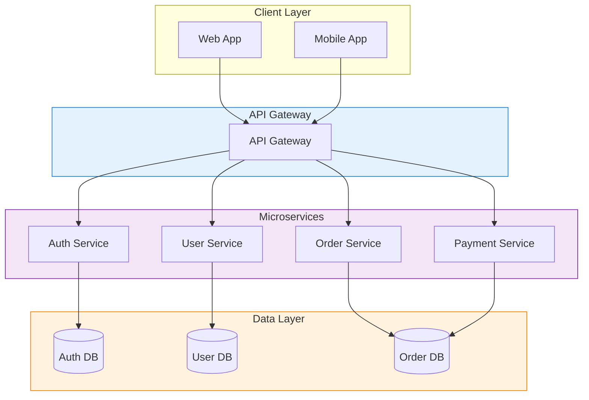
```mermaid
flowchart TB
    subgraph clients[Client Layer]
        Web[Web App]
        Mobile[Mobile App]
    end
    
    subgraph gateway[API Gateway]
        GW[API Gateway]
    end
    
    subgraph services[Microservices]
        Auth[Auth Service]
        User[User Service]
        Order[Order Service]
        Payment[Payment Service]
    end
    
    subgraph data[Data Layer]
        AuthDB[(Auth DB)]
        UserDB[(User DB)]
        OrderDB[(Order DB)]
    end
    
    Web --> GW
    Mobile --> GW
    GW --> Auth
    GW --> User
    GW --> Order
    GW --> Payment
    
    Auth --> AuthDB
    User --> UserDB
    Order --> OrderDB
    Payment --> OrderDB
    
    style gateway fill:#e3f2fd,stroke:#1976d2
    style services fill:#f3e5f5,stroke:#7b1fa2
    style data fill:#fff3e0,stroke:#f57c00
```

### Event-Driven Architecture

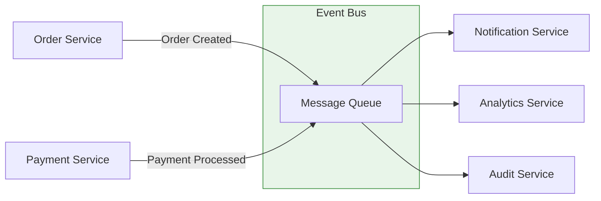
```mermaid
flowchart LR
    Producer1[Order Service]
    Producer2[Payment Service]
    
    subgraph eventBus[Event Bus]
        Queue[Message Queue]
    end
    
    Consumer1[Notification Service]
    Consumer2[Analytics Service]
    Consumer3[Audit Service]
    
    Producer1 -->|Order Created| Queue
    Producer2 -->|Payment Processed| Queue
    
    Queue --> Consumer1
    Queue --> Consumer2
    Queue --> Consumer3
    
    style eventBus fill:#e8f5e9,stroke:#388e3c
```

## Business Process Patterns

### Approval Workflow

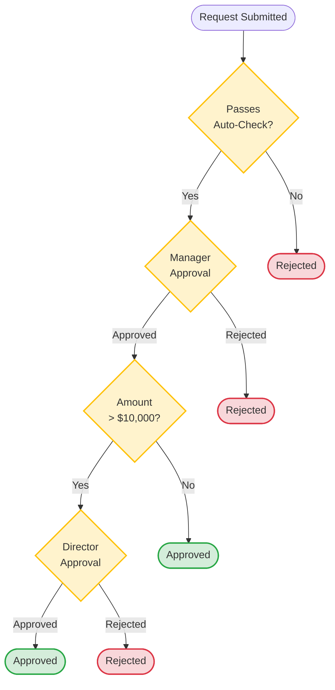
```mermaid
flowchart TD
    Start([Request Submitted]) --> AutoCheck{Passes<br/>Auto-Check?}
    
    AutoCheck -->|Yes| Manager{Manager<br/>Approval}
    AutoCheck -->|No| Rejected1([Rejected])
    
    Manager -->|Approved| Amount{Amount<br/>> $10,000?}
    Manager -->|Rejected| Rejected2([Rejected])
    
    Amount -->|Yes| Director{Director<br/>Approval}
    Amount -->|No| Approved1([Approved])
    
    Director -->|Approved| Approved2([Approved])
    Director -->|Rejected| Rejected3([Rejected])
    
    classDef approved fill:#d4edda,stroke:#28a745,stroke-width:2px
    classDef rejected fill:#f8d7da,stroke:#dc3545,stroke-width:2px
    classDef decision fill:#fff3cd,stroke:#ffc107,stroke-width:2px
    
    class Approved1,Approved2 approved
    class Rejected1,Rejected2,Rejected3 rejected
    class AutoCheck,Manager,Amount,Director decision
```

### Customer Journey

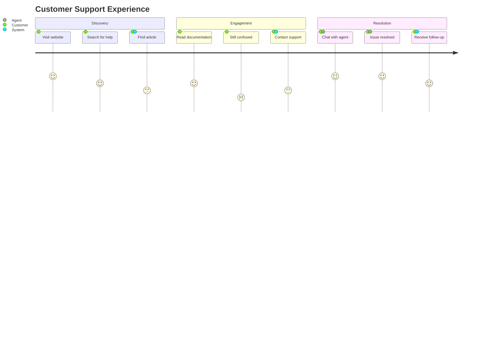
```mermaid
journey
    title Customer Support Experience
    section Discovery
        Visit website: 5: Customer
        Search for help: 4: Customer
        Find article: 3: Customer, System
    section Engagement
        Read documentation: 4: Customer
        Still confused: 2: Customer
        Contact support: 3: Customer, System
    section Resolution
        Chat with agent: 5: Customer, Agent
        Issue resolved: 5: Customer, Agent
        Receive follow-up: 4: Customer, System
```

## Database Design Patterns

### E-commerce Database Schema

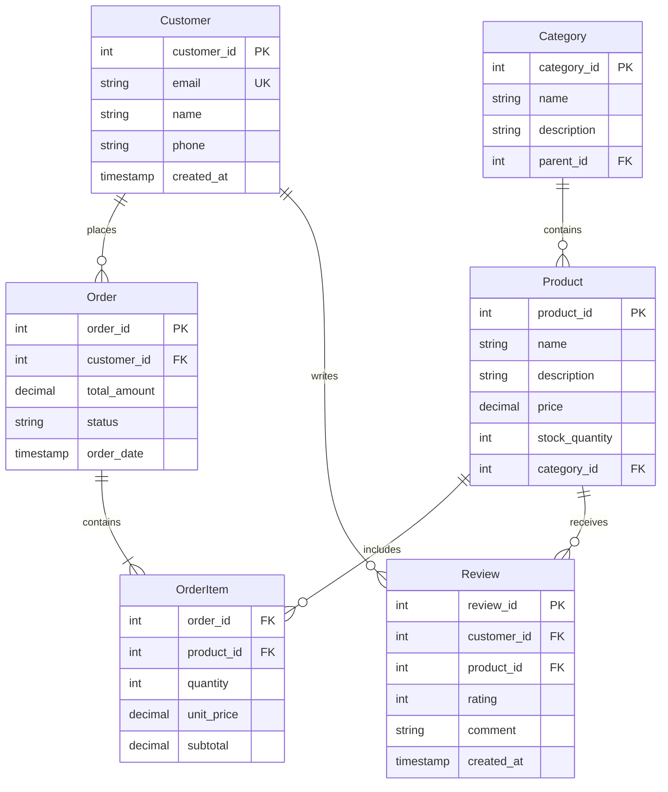
```mermaid
erDiagram
    Customer ||--o{ Order : places
    Customer {
        int customer_id PK
        string email UK
        string name
        string phone
        timestamp created_at
    }
    
    Order ||--|{ OrderItem : contains
    Order {
        int order_id PK
        int customer_id FK
        decimal total_amount
        string status
        timestamp order_date
    }
    
    Product ||--o{ OrderItem : includes
    Product {
        int product_id PK
        string name
        string description
        decimal price
        int stock_quantity
        int category_id FK
    }
    
    Category ||--o{ Product : contains
    Category {
        int category_id PK
        string name
        string description
        int parent_id FK
    }
    
    OrderItem {
        int order_id FK
        int product_id FK
        int quantity
        decimal unit_price
        decimal subtotal
    }
    
    Customer ||--o{ Review : writes
    Product ||--o{ Review : receives
    Review {
        int review_id PK
        int customer_id FK
        int product_id FK
        int rating
        string comment
        timestamp created_at
    }
```

### Multi-tenant SaaS Database

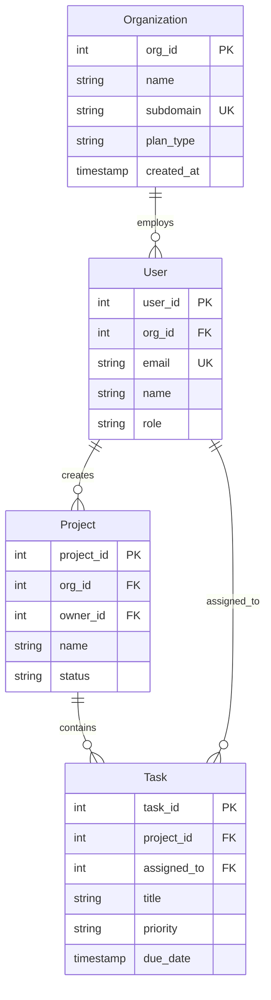
```mermaid
erDiagram
    Organization ||--o{ User : employs
    Organization {
        int org_id PK
        string name
        string subdomain UK
        string plan_type
        timestamp created_at
    }
    
    User ||--o{ Project : creates
    User {
        int user_id PK
        int org_id FK
        string email UK
        string name
        string role
    }
    
    Project ||--o{ Task : contains
    Project {
        int project_id PK
        int org_id FK
        int owner_id FK
        string name
        string status
    }
    
    Task }o--|| User : assigned_to
    Task {
        int task_id PK
        int project_id FK
        int assigned_to FK
        string title
        string priority
        timestamp due_date
    }
```

## API Interaction Patterns

### REST API Authentication Flow

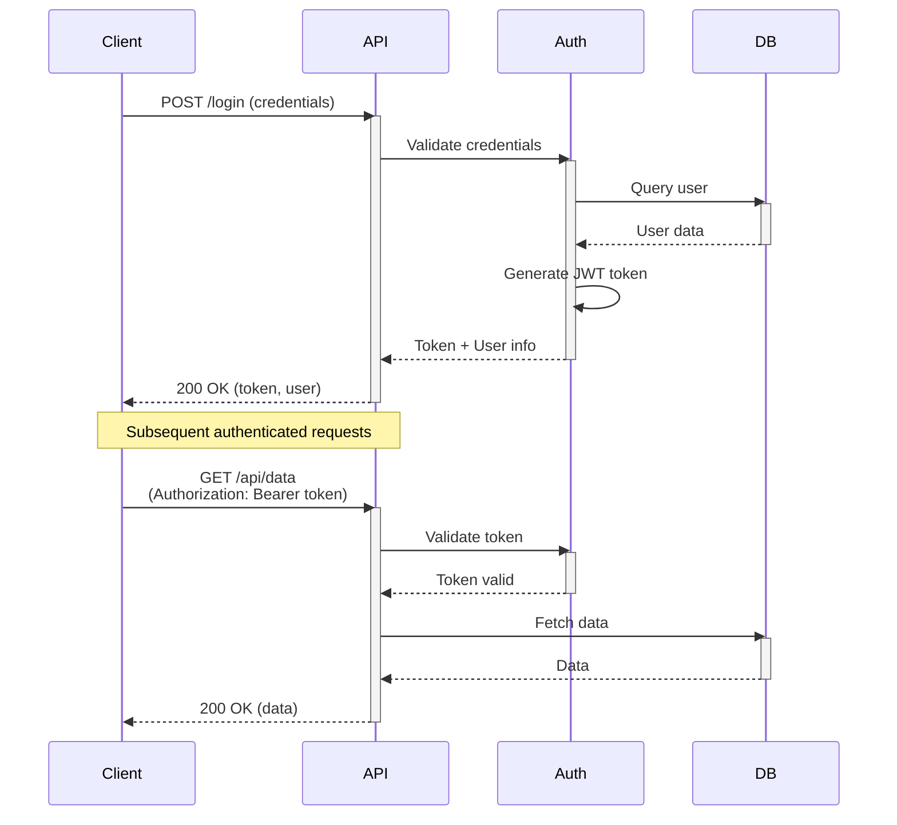
```mermaid
sequenceDiagram
    participant Client
    participant API
    participant Auth
    participant DB
    
    Client->>API: POST /login (credentials)
    activate API
    API->>Auth: Validate credentials
    activate Auth
    Auth->>DB: Query user
    activate DB
    DB-->>Auth: User data
    deactivate DB
    Auth->>Auth: Generate JWT token
    Auth-->>API: Token + User info
    deactivate Auth
    API-->>Client: 200 OK (token, user)
    deactivate API
    
    Note over Client,API: Subsequent authenticated requests
    
    Client->>API: GET /api/data<br/>(Authorization: Bearer token)
    activate API
    API->>Auth: Validate token
    activate Auth
    Auth-->>API: Token valid
    deactivate Auth
    API->>DB: Fetch data
    activate DB
    DB-->>API: Data
    deactivate DB
    API-->>Client: 200 OK (data)
    deactivate API
```

### Webhook Event Processing

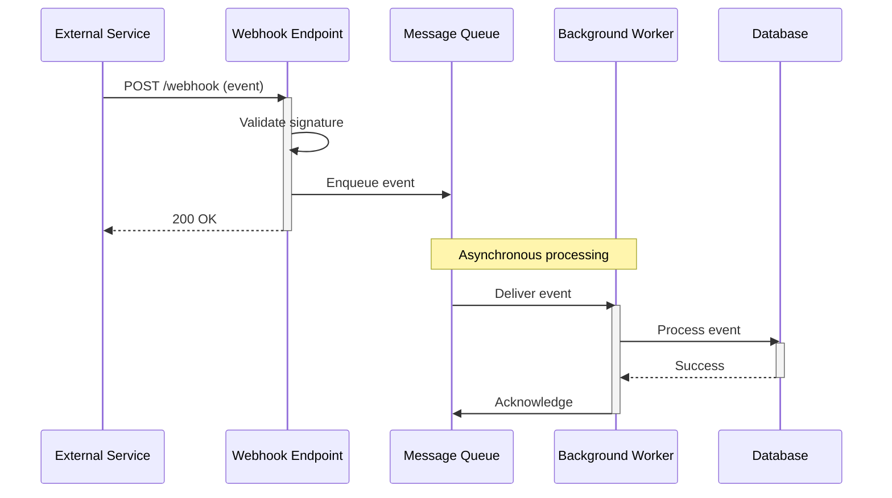
```mermaid
sequenceDiagram
    participant External as External Service
    participant Webhook as Webhook Endpoint
    participant Queue as Message Queue
    participant Worker as Background Worker
    participant DB as Database
    
    External->>Webhook: POST /webhook (event)
    activate Webhook
    Webhook->>Webhook: Validate signature
    Webhook->>Queue: Enqueue event
    Webhook-->>External: 200 OK
    deactivate Webhook
    
    Note over Queue,Worker: Asynchronous processing
    
    Queue->>Worker: Deliver event
    activate Worker
    Worker->>DB: Process event
    activate DB
    DB-->>Worker: Success
    deactivate DB
    Worker->>Queue: Acknowledge
    deactivate Worker
```

## DevOps Patterns

### CI/CD Pipeline

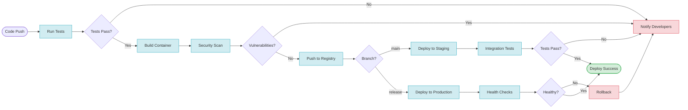
```mermaid
flowchart LR
    A([Code Push]) --> B[Run Tests]
    B --> C{Tests Pass?}
    C -->|No| D[Notify Developers]
    C -->|Yes| E[Build Container]
    E --> F[Security Scan]
    F --> G{Vulnerabilities?}
    G -->|Yes| D
    G -->|No| H[Push to Registry]
    H --> I{Branch?}
    I -->|main| J[Deploy to Staging]
    I -->|release| K[Deploy to Production]
    J --> L[Integration Tests]
    K --> M[Health Checks]
    L --> N{Tests Pass?}
    N -->|No| D
    N -->|Yes| O([Deploy Success])
    M --> P{Healthy?}
    P -->|No| Q[Rollback]
    P -->|Yes| O
    Q --> D
    
    classDef success fill:#d4edda,stroke:#28a745
    classDef error fill:#f8d7da,stroke:#dc3545
    classDef process fill:#d1ecf1,stroke:#17a2b8
    
    class O success
    class D,Q error
    class B,E,F,H,J,K,L,M process
```

### Deployment Architecture

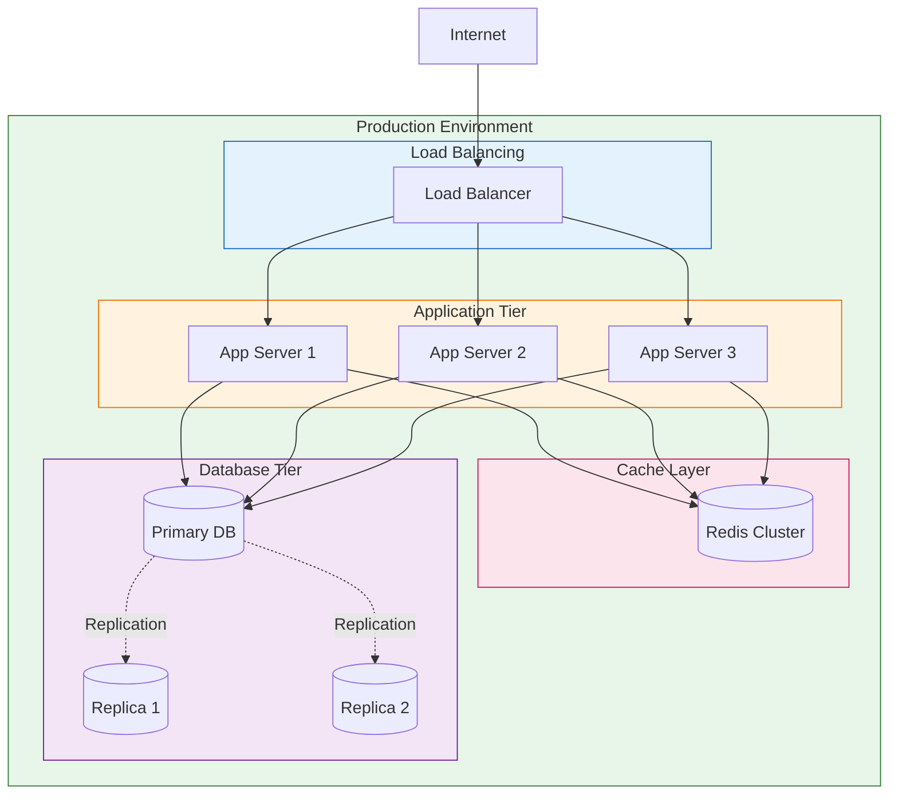
```mermaid
flowchart TB
    subgraph prod[Production Environment]
        direction TB
        subgraph lb[Load Balancing]
            LB[Load Balancer]
        end
        subgraph app[Application Tier]
            App1[App Server 1]
            App2[App Server 2]
            App3[App Server 3]
        end
        subgraph cache[Cache Layer]
            Redis[(Redis Cluster)]
        end
        subgraph db[Database Tier]
            Primary[(Primary DB)]
            Replica1[(Replica 1)]
            Replica2[(Replica 2)]
        end
    end
    
    Internet[Internet] --> LB
    LB --> App1
    LB --> App2
    LB --> App3
    
    App1 --> Redis
    App2 --> Redis
    App3 --> Redis
    
    App1 --> Primary
    App2 --> Primary
    App3 --> Primary
    
    Primary -.->|Replication| Replica1
    Primary -.->|Replication| Replica2
    
    style prod fill:#e8f5e9,stroke:#2e7d32
    style lb fill:#e3f2fd,stroke:#1565c0
    style app fill:#fff3e0,stroke:#ef6c00
    style cache fill:#fce4ec,stroke:#c2185b
    style db fill:#f3e5f5,stroke:#6a1b9a
```

## State Machine Patterns

### Order Lifecycle

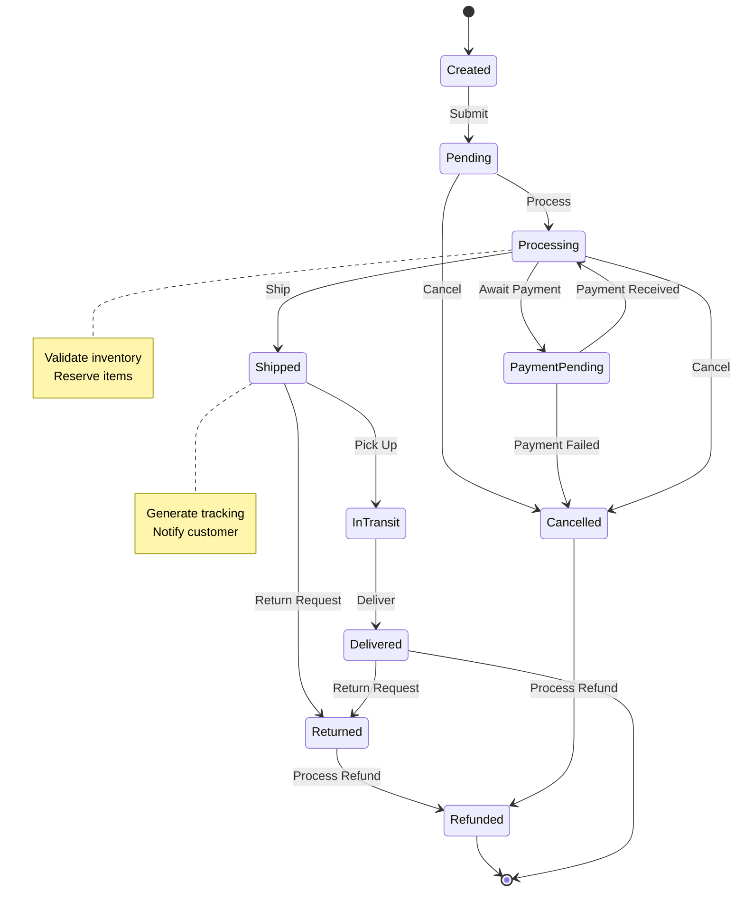
```mermaid
stateDiagram-v2
    [*] --> Created
    Created --> Pending: Submit
    Pending --> Processing: Process
    Pending --> Cancelled: Cancel
    
    Processing --> PaymentPending: Await Payment
    PaymentPending --> Processing: Payment Received
    PaymentPending --> Cancelled: Payment Failed
    
    Processing --> Shipped: Ship
    Shipped --> InTransit: Pick Up
    InTransit --> Delivered: Deliver
    
    Processing --> Cancelled: Cancel
    Shipped --> Returned: Return Request
    Delivered --> Returned: Return Request
    
    Returned --> Refunded: Process Refund
    Cancelled --> Refunded: Process Refund
    
    Refunded --> [*]
    Delivered --> [*]
    
    note right of Processing
        Validate inventory
        Reserve items
    end note
    
    note right of Shipped
        Generate tracking
        Notify customer
    end note
```

### User Authentication States

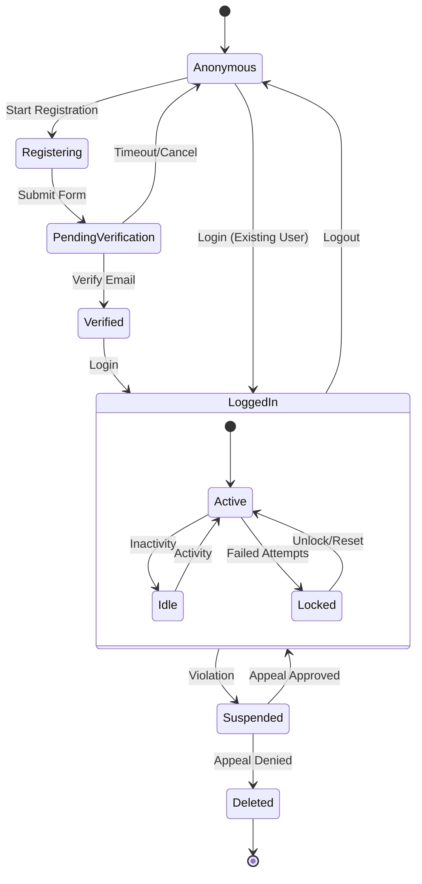
```mermaid
stateDiagram-v2
    [*] --> Anonymous
    Anonymous --> Registering: Start Registration
    Registering --> PendingVerification: Submit Form
    PendingVerification --> Verified: Verify Email
    PendingVerification --> Anonymous: Timeout/Cancel
    
    Verified --> LoggedIn: Login
    Anonymous --> LoggedIn: Login (Existing User)
    
    state LoggedIn {
        [*] --> Active
        Active --> Idle: Inactivity
        Idle --> Active: Activity
        Active --> Locked: Failed Attempts
        Locked --> Active: Unlock/Reset
    }
    
    LoggedIn --> Anonymous: Logout
    LoggedIn --> Suspended: Violation
    Suspended --> LoggedIn: Appeal Approved
    Suspended --> Deleted: Appeal Denied
    
    Deleted --> [*]
```

## Project Management Patterns

### Agile Sprint Timeline

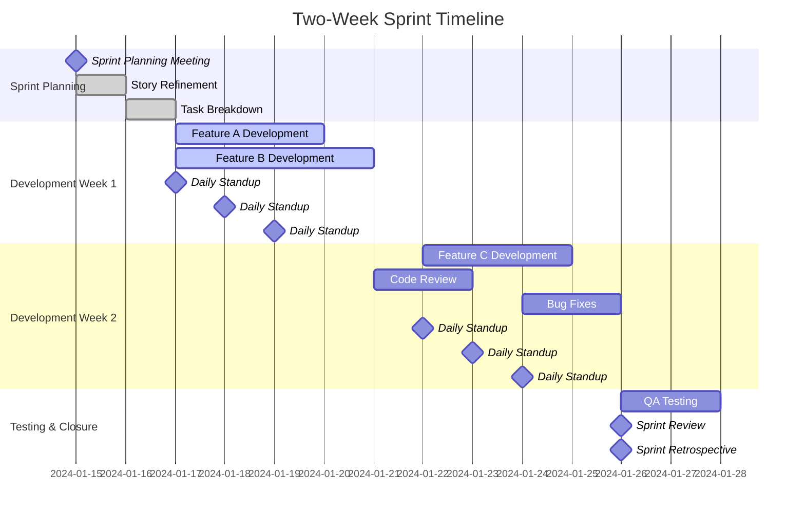
```mermaid
gantt
    title Two-Week Sprint Timeline
    dateFormat YYYY-MM-DD
    
    section Sprint Planning
        Sprint Planning Meeting    :milestone, planning, 2024-01-15, 0d
        Story Refinement          :done, refine, 2024-01-15, 1d
        Task Breakdown            :done, tasks, 2024-01-16, 1d
    
    section Development Week 1
        Feature A Development     :active, featA, 2024-01-17, 3d
        Feature B Development     :active, featB, 2024-01-17, 4d
        Daily Standup            :milestone, standup1, 2024-01-17, 0d
        Daily Standup            :milestone, standup2, 2024-01-18, 0d
        Daily Standup            :milestone, standup3, 2024-01-19, 0d
    
    section Development Week 2
        Feature C Development     :featC, 2024-01-22, 3d
        Code Review              :review, after featA featB, 2d
        Bug Fixes                :bugs, 2024-01-24, 2d
        Daily Standup            :milestone, standup4, 2024-01-22, 0d
        Daily Standup            :milestone, standup5, 2024-01-23, 0d
        Daily Standup            :milestone, standup6, 2024-01-24, 0d
    
    section Testing & Closure
        QA Testing               :test, after review, 2d
        Sprint Review            :milestone, review, 2024-01-26, 0d
        Sprint Retrospective     :milestone, retro, 2024-01-26, 0d
```

### Product Roadmap

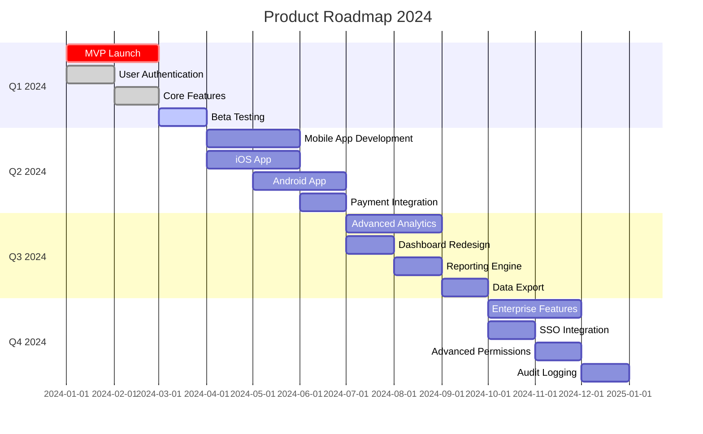
```mermaid
gantt
    title Product Roadmap 2024
    dateFormat YYYY-MM
    
    section Q1 2024
        MVP Launch               :crit, mvp, 2024-01, 2024-03
        User Authentication      :done, auth, 2024-01, 1M
        Core Features           :done, core, 2024-02, 1M
        Beta Testing            :active, beta, 2024-03, 1M
    
    section Q2 2024
        Mobile App Development   :mobile, 2024-04, 2024-06
        iOS App                 :ios, 2024-04, 2M
        Android App             :android, 2024-05, 2M
        Payment Integration     :payment, 2024-06, 1M
    
    section Q3 2024
        Advanced Analytics       :analytics, 2024-07, 2024-09
        Dashboard Redesign      :dashboard, 2024-07, 1M
        Reporting Engine        :reports, 2024-08, 1M
        Data Export             :export, 2024-09, 1M
    
    section Q4 2024
        Enterprise Features      :enterprise, 2024-10, 2024-12
        SSO Integration         :sso, 2024-10, 1M
        Advanced Permissions    :perms, 2024-11, 1M
        Audit Logging           :audit, 2024-12, 1M
```

## Algorithm Visualization

### Binary Search Algorithm

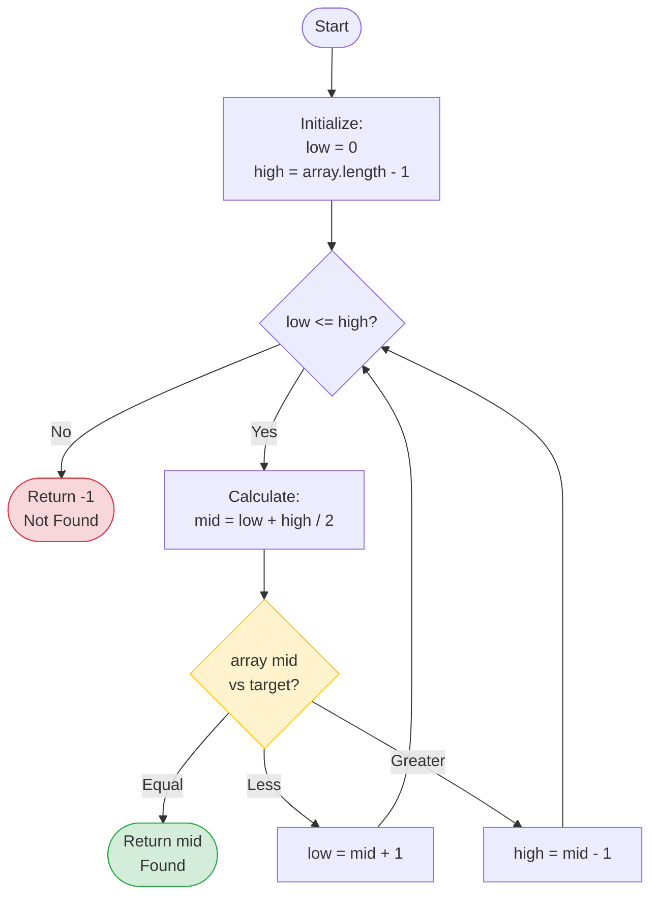
```mermaid
flowchart TD
    Start([Start]) --> Init[Initialize:<br/>low = 0<br/>high = array.length - 1]
    Init --> Check{low <= high?}
    Check -->|No| NotFound([Return -1<br/>Not Found])
    Check -->|Yes| CalcMid[Calculate:<br/>mid = low + high / 2]
    CalcMid --> Compare{array mid<br/>vs target?}
    Compare -->|Equal| Found([Return mid<br/>Found])
    Compare -->|Less| AdjustLow[low = mid + 1]
    Compare -->|Greater| AdjustHigh[high = mid - 1]
    AdjustLow --> Check
    AdjustHigh --> Check
    
    style Found fill:#d4edda,stroke:#28a745
    style NotFound fill:#f8d7da,stroke:#dc3545
    style Compare fill:#fff3cd,stroke:#ffc107
```

### Sorting Visualization (Merge Sort)

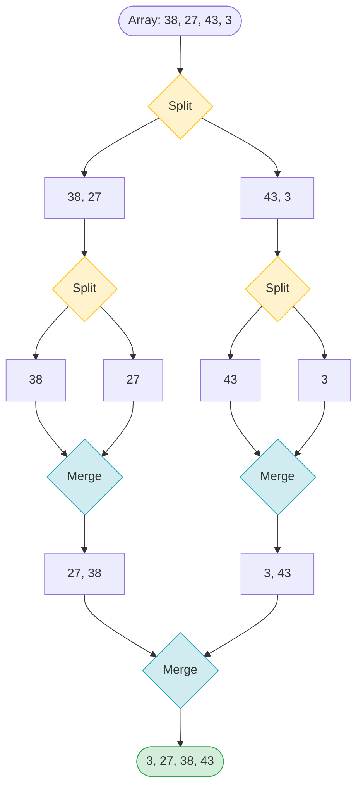
```mermaid
flowchart TB
    Start([Array: 38, 27, 43, 3]) --> Split1{Split}
    Split1 --> Left1[38, 27]
    Split1 --> Right1[43, 3]
    
    Left1 --> Split2{Split}
    Split2 --> Left2[38]
    Split2 --> Right2[27]
    
    Right1 --> Split3{Split}
    Split3 --> Left3[43]
    Split3 --> Right3[3]
    
    Left2 --> Merge1{Merge}
    Right2 --> Merge1
    Merge1 --> Sorted1[27, 38]
    
    Left3 --> Merge2{Merge}
    Right3 --> Merge2
    Merge2 --> Sorted2[3, 43]
    
    Sorted1 --> FinalMerge{Merge}
    Sorted2 --> FinalMerge
    FinalMerge --> Result([3, 27, 38, 43])
    
    classDef split fill:#fff3cd,stroke:#ffc107
    classDef merge fill:#d1ecf1,stroke:#17a2b8
    classDef result fill:#d4edda,stroke:#28a745
    
    class Split1,Split2,Split3 split
    class Merge1,Merge2,FinalMerge merge
    class Result result
```

## Data Visualization Patterns

### Market Share Analysis

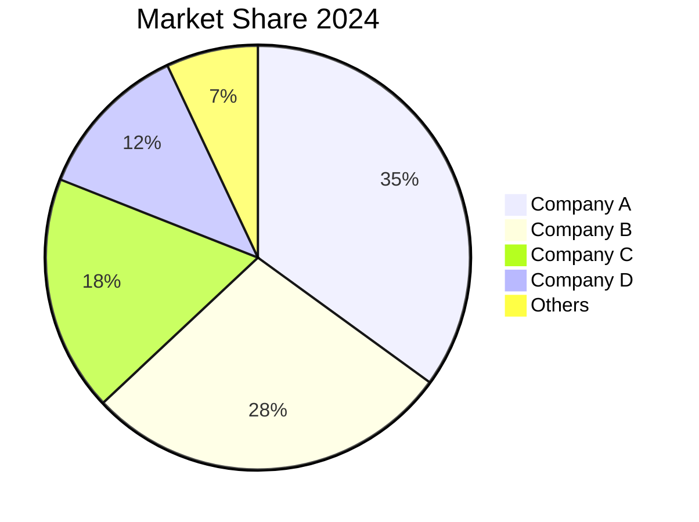
```mermaid
pie title Market Share 2024
    "Company A" : 35
    "Company B" : 28
    "Company C" : 18
    "Company D" : 12
    "Others" : 7
```

### Priority Matrix

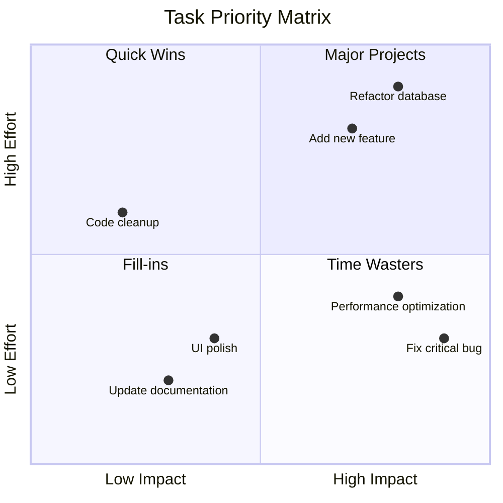
```mermaid
quadrantChart
    title Task Priority Matrix
    x-axis Low Impact --> High Impact
    y-axis Low Effort --> High Effort
    quadrant-1 Major Projects
    quadrant-2 Quick Wins
    quadrant-3 Fill-ins
    quadrant-4 Time Wasters
    Refactor database: [0.8, 0.9]
    Fix critical bug: [0.9, 0.3]
    Update documentation: [0.3, 0.2]
    Add new feature: [0.7, 0.8]
    Code cleanup: [0.2, 0.6]
    Performance optimization: [0.8, 0.4]
    UI polish: [0.4, 0.3]
```

## Tips for Using These Patterns

1. **Customize for your context**: These are templates - adapt node names, structure, and styling to your specific needs

2. **Combine patterns**: Mix elements from different patterns when appropriate (e.g., add authentication flow to architecture diagram)

3. **Keep it focused**: Use these as starting points but don't feel obligated to include everything - simplify as needed

4. **Maintain consistency**: If you use multiple diagrams in a project, keep styling and conventions consistent

5. **Progressive disclosure**: Start with high-level patterns, create detailed diagrams only when needed
