# Mermaid Syntax Reference

Complete syntax guide for all Mermaid diagram types.

## Flowcharts & Graphs

### Basic Syntax

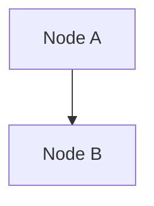

### Direction Options

- `TD` or `TB` - Top to bottom (default)
- `BT` - Bottom to top
- `LR` - Left to right
- `RL` - Right to left

### Node Shapes Reference

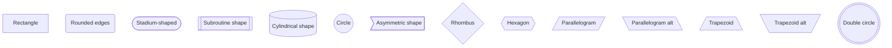

### Link Types

**Solid Links:**
```mermaid
flowchart LR
    A --> B     %% Arrow
    C --- D     %% No arrow
    E -- Text --> F     %% Labeled arrow
    G ---|Text| H       %% Labeled line
```

**Dotted Links:**
```mermaid
flowchart LR
    A -.-> B     %% Dotted arrow
    C -.- D      %% Dotted line
    E -. Text .-> F     %% Labeled dotted arrow
```

**Thick Links:**
```mermaid
flowchart LR
    A ==> B      %% Thick arrow
    C === D      %% Thick line
    E == Text ==> F     %% Labeled thick arrow
```

**Chaining:**
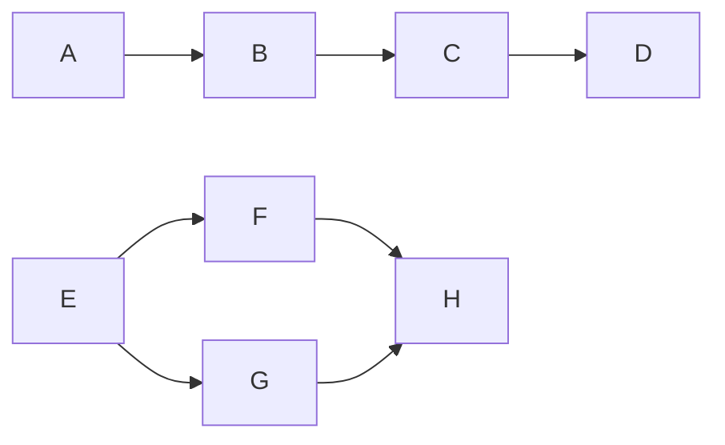

### Multi-directional Arrows

```mermaid
flowchart LR
    A <--> B    %% Bidirectional
    C --o D     %% Circle end
    E --x F     %% Cross end
    G o--o H    %% Circle both ends
    I <-.-> J   %% Dotted bidirectional
    K x--x L    %% Cross both ends
```

### Minimum and Maximum Lengths

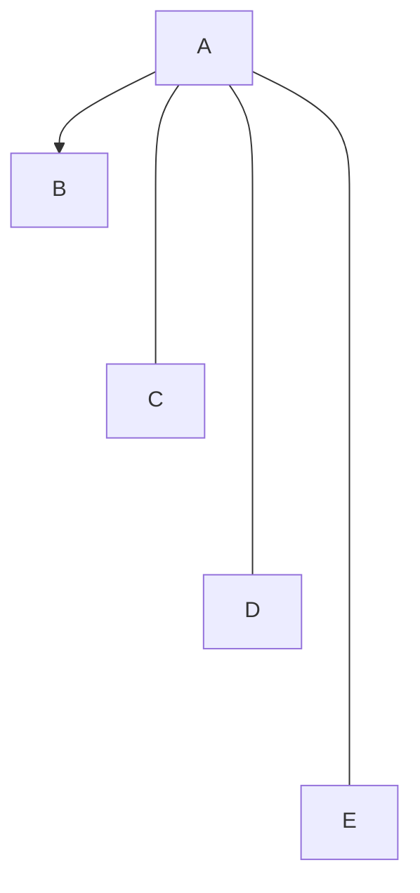

### Subgraphs

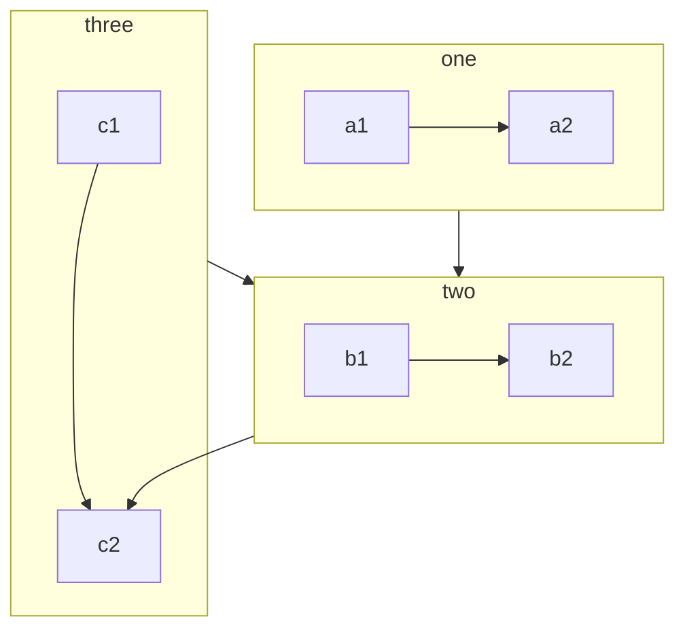

**Labeled subgraphs:**
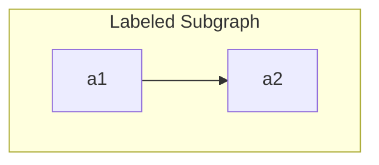

**Subgraph direction:**
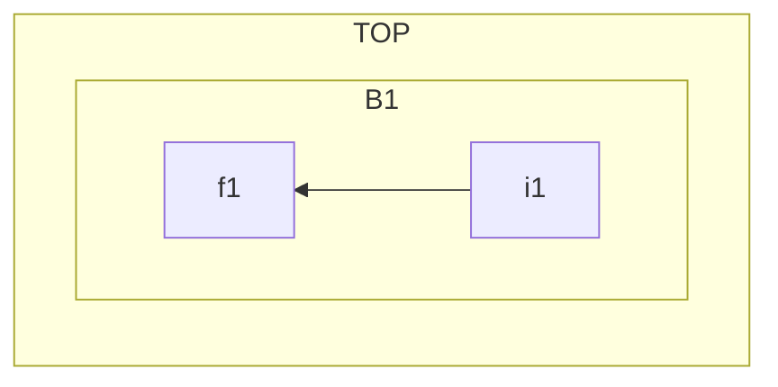

### Styling

**Individual node styling:**
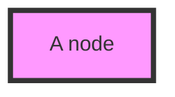

**Class definitions:**
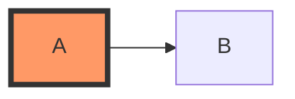

**Multiple classes:**
```mermaid
flowchart LR
    A:::foo:::bar --> B
    classDef foo stroke:#f00
    classDef bar fill:#00f
```

**CSS classes:**
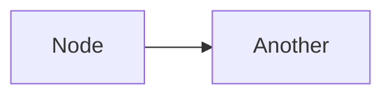

**Default class:**
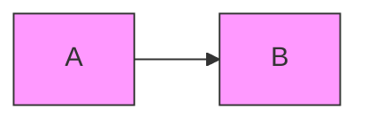

### Interaction

**Click events:**
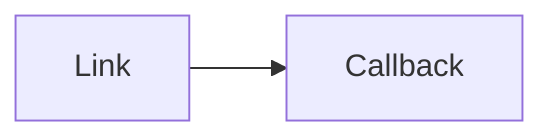

**Comments:**


## Sequence Diagrams

### Basic Syntax

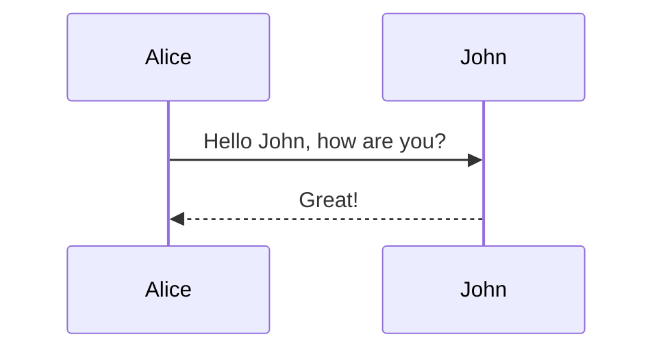

### Participants

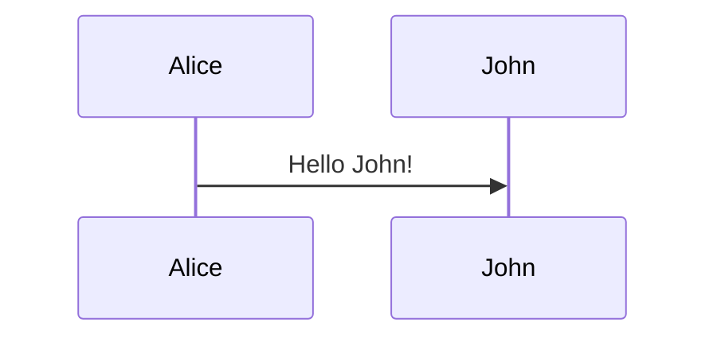

**Actor styling:**
```mermaid
sequenceDiagram
    actor Alice
    actor Bob
    Alice->>Bob: Hi Bob
```

### Arrows

- `->` Solid line without arrow
- `-->` Dotted line without arrow
- `->>` Solid line with arrowhead
- `-->>` Dotted line with arrowhead
- `-x` Solid line with cross
- `--x` Dotted line with cross
- `-)` Solid line with open arrow
- `--)` Dotted line with open arrow

### Activations

```mermaid
sequenceDiagram
    Alice->>John: Hello John!
    activate John
    John-->>Alice: Great!
    deactivate John
```

**Shorthand:**
```mermaid
sequenceDiagram
    Alice->>+John: Hello John!
    John-->>-Alice: Great!
```

**Nested activations:**
```mermaid
sequenceDiagram
    Alice->>+John: Hello John!
    Alice->>+John: John, can you hear me?
    John-->>-Alice: Hi Alice, I can hear you!
    John-->>-Alice: I feel great!
```

### Notes

```mermaid
sequenceDiagram
    participant John
    Note right of John: Text in note
    Note left of John: Text in note
    Note over Alice,John: Text spanning multiple
```

### Loops

```mermaid
sequenceDiagram
    Alice->John: Hello John!
    loop Every minute
        John-->Alice: Great!
    end
```

### Alt/Else

```mermaid
sequenceDiagram
    Alice->>Bob: Hello Bob!
    alt is sick
        Bob->>Alice: Not so good
    else is well
        Bob->>Alice: Feeling fresh!
    end
```

### Optional

```mermaid
sequenceDiagram
    Alice->>Bob: Hello Bob!
    opt Extra response
        Bob->>Alice: Thanks!
    end
```

### Parallel

```mermaid
sequenceDiagram
    par Alice to Bob
        Alice->>Bob: Hello guys!
    and Alice to John
        Alice->>John: Hello guys!
    end
    Bob-->>Alice: Hi Alice!
    John-->>Alice: Hi Alice!
```

### Critical Region

```mermaid
sequenceDiagram
    critical Establish connection
        Service A-->Service B: connect
    option Network timeout
        Service A-->Service B: timeout
    option Network error
        Service A-->Service B: error
    end
```

### Break

```mermaid
sequenceDiagram
    Consumer-->API: Book something
    API-->BookingService: Book
    break when BookingService unavailable
        API-->Consumer: Service unavailable
    end
```

### Background Highlighting

```mermaid
sequenceDiagram
    participant Alice
    participant Bob
    rect rgb(191, 223, 255)
    note right of Alice: Alice calls Bob
    Alice->>+Bob: Hello Bob, how are you?
    rect rgb(200, 150, 255)
    Alice->>+Bob: Can you help me?
    end
    Bob-->>-Alice: I can!
    end
    Bob-->>-Alice: Great!
```

### Sequence Numbers

```mermaid
sequenceDiagram
    autonumber
    Alice->>John: Hello John!
    John-->>Alice: Great!
```

## Class Diagrams

### Basic Syntax

```mermaid
classDiagram
    Animal <|-- Duck
    Animal <|-- Fish
    Animal : +int age
    Animal : +String gender
    Animal: +isMammal()
    class Duck{
        +String beakColor
        +swim()
        +quack()
    }
```

### Defining Members

**Visibility:**
- `+` Public
- `-` Private
- `#` Protected
- `~` Package/Internal

```mermaid
classDiagram
    class BankAccount{
        +String owner
        +BigDecimal balance
        +deposit(amount) bool
        +withdrawal(amount) int
    }
```

**Return types:**
```mermaid
classDiagram
    class BankAccount{
        +deposit(amount: float): bool
        +withdrawal(amount: float): int
    }
```

**Generic types:**
```mermaid
classDiagram
    class Square~Shape~{
        +setPoints(List~Point~)
        +getPoints() List~Point~
    }
```

### Relationships

**Inheritance:**
```mermaid
classDiagram
    classA <|-- classB
```

**Composition:**
```mermaid
classDiagram
    classA *-- classB
```

**Aggregation:**
```mermaid
classDiagram
    classA o-- classB
```

**Association:**
```mermaid
classDiagram
    classA --> classB
```

**Link (solid):**
```mermaid
classDiagram
    classA -- classB
```

**Dependency:**
```mermaid
classDiagram
    classA ..> classB
```

**Realization:**
```mermaid
classDiagram
    classA ..|> classB
```

**Bidirectional:**
```mermaid
classDiagram
    Animal <--> Habitat
```

### Cardinality

```mermaid
classDiagram
    Customer "1" --> "*" Ticket
    Student "1" --> "1..*" Course
    Galaxy --> "many" Star
```

### Annotations

```mermaid
classDiagram
    class Shape{
        <<interface>>
        +draw()
    }
    class Color{
        <<enumeration>>
        RED
        BLUE
        GREEN
    }
    class Foo{
        <<service>>
        +doSomething()
    }
```

### Comments

```mermaid
classDiagram
    %% This is a comment
    Animal <|-- Duck
```

## State Diagrams

### Basic Syntax

```mermaid
stateDiagram-v2
    [*] --> Still
    Still --> [*]
    Still --> Moving
    Moving --> Still
    Moving --> Crash
    Crash --> [*]
```

### Transitions

```mermaid
stateDiagram-v2
    s1 --> s2: Label on transition
```

### Start and End

```mermaid
stateDiagram-v2
    [*] --> Still
    Still --> [*]
```

### Composite States

```mermaid
stateDiagram-v2
    [*] --> First
    state First {
        [*] --> Second
        Second --> Third
        Third --> [*]
    }
```

### Choice

```mermaid
stateDiagram-v2
    state if_state <<choice>>
    [*] --> IsPositive
    IsPositive --> if_state
    if_state --> False: if n < 0
    if_state --> True : if n >= 0
```

### Fork

```mermaid
stateDiagram-v2
    state fork_state <<fork>>
    [*] --> fork_state
    fork_state --> State2
    fork_state --> State3
    
    state join_state <<join>>
    State2 --> join_state
    State3 --> join_state
    join_state --> State4
    State4 --> [*]
```

### Notes

```mermaid
stateDiagram-v2
    State1: The state with a note
    note right of State1
        Important information
    end note
```

### Concurrency

```mermaid
stateDiagram-v2
    [*] --> Active
    
    state Active {
        [*] --> NumLockOff
        NumLockOff --> NumLockOn : EvNumLockPressed
        NumLockOn --> NumLockOff : EvNumLockPressed
        --
        [*] --> CapsLockOff
        CapsLockOff --> CapsLockOn : EvCapsLockPressed
        CapsLockOn --> CapsLockOff : EvCapsLockPressed
    }
```

## Entity Relationship Diagrams

### Basic Syntax

```mermaid
erDiagram
    CUSTOMER ||--o{ ORDER : places
    ORDER ||--|{ LINE-ITEM : contains
```

### Relationships

**Cardinality:**
- `|o` - Zero or one
- `||` - Exactly one
- `}o` - Zero or more
- `}|` - One or more

**Relationship types:**
- `--` - Non-identifying relationship
- `..` - Identifying relationship

```mermaid
erDiagram
    CUSTOMER ||--o{ ORDER : places
    CUSTOMER }|--|{ DELIVERY-ADDRESS : uses
```

### Attributes

```mermaid
erDiagram
    CUSTOMER {
        string name
        string custNumber PK
        string sector FK
    }
    CUSTOMER ||--o{ ORDER : places
```

**Attribute types:**
- Key indicators: `PK`, `FK`, `UK` (Primary, Foreign, Unique Key)
- Data types: `string`, `int`, `float`, `date`, `boolean`, etc.

### Comments

```mermaid
erDiagram
    %% This is a comment
    CUSTOMER ||--o{ ORDER : places
```

## Gantt Charts

### Basic Syntax

```mermaid
gantt
    title A Gantt Diagram
    dateFormat YYYY-MM-DD
    section Section
        A task           :a1, 2024-01-01, 30d
        Another task     :after a1, 20d
```

### Sections

```mermaid
gantt
    title Project Timeline
    dateFormat YYYY-MM-DD
    section Planning
        Task 1           :2024-01-01, 30d
    section Development
        Task 2           :2024-02-01, 60d
    section Testing
        Task 3           :2024-04-01, 30d
```

### Task States

- `done` - Completed
- `active` - In progress
- `crit` - Critical path
- `milestone` - Milestone marker

```mermaid
gantt
    title Task States
    dateFormat YYYY-MM-DD
    section Section
        Completed task      :done, task1, 2024-01-01, 3d
        Active task         :active, task2, after task1, 3d
        Future task         :task3, after task2, 3d
        Critical task       :crit, task4, 2024-01-01, 3d
        Milestone           :milestone, after task4, 0d
```

### Dependencies

```mermaid
gantt
    dateFormat YYYY-MM-DD
    Task A           :a1, 2024-01-01, 5d
    Task B           :a2, after a1, 3d
    Task C           :a3, after a1, 4d
    Task D           :a4, after a2 a3, 2d
```

## Pie Charts

### Basic Syntax

```mermaid
pie title Pets adopted by volunteers
    "Dogs" : 386
    "Cats" : 85
    "Rats" : 15
```

### Show Data

```mermaid
pie showData
    title Fruit Sales
    "Apples" : 30
    "Bananas" : 25
    "Oranges" : 20
    "Grapes" : 15
    "Other" : 10
```

## Git Graph

### Basic Syntax

```mermaid
gitGraph
    commit
    commit
    branch develop
    checkout develop
    commit
    commit
    checkout main
    merge develop
```

### Advanced Features

```mermaid
gitGraph
    commit id: "Initial"
    branch develop
    checkout develop
    commit id: "Feature 1"
    commit id: "Feature 2"
    checkout main
    commit id: "Hotfix" tag: "v1.0.1"
    checkout develop
    merge main
    commit id: "Feature 3"
    checkout main
    merge develop tag: "v1.1.0"
```

## User Journey

### Basic Syntax

```mermaid
journey
    title My working day
    section Go to work
        Make tea: 5: Me
        Go upstairs: 3: Me
        Do work: 1: Me, Cat
    section Go home
        Go downstairs: 5: Me
        Sit down: 5: Me
```

**Scores:**
- 1-5 scale (1 = very bad, 5 = very good)

## Quadrant Chart

### Basic Syntax

```mermaid
quadrantChart
    title Reach and engagement of campaigns
    x-axis Low Reach --> High Reach
    y-axis Low Engagement --> High Engagement
    quadrant-1 We should expand
    quadrant-2 Need to promote
    quadrant-3 Re-evaluate
    quadrant-4 May be improved
    Campaign A: [0.3, 0.6]
    Campaign B: [0.45, 0.23]
    Campaign C: [0.57, 0.69]
    Campaign D: [0.78, 0.34]
```

## Timeline

### Basic Syntax

```mermaid
timeline
    title History of Social Media Platform
    2002 : LinkedIn
    2004 : Facebook : Google
    2005 : YouTube
    2006 : Twitter
```

### Sections

```mermaid
timeline
    title Engineering Milestones
    section 2020
        January : Project kickoff
        March : Alpha release
    section 2021
        June : Beta release
        December : Version 1.0
```

## Common Patterns

### Escaping Characters

**Special characters in labels:**
```mermaid
flowchart LR
    A["Text with #quot;quotes#quot;"]
    B["Text with special: #lt;#gt;#amp;"]
```

### Line Breaks

```mermaid
flowchart TD
    A["Line 1<br/>Line 2<br/>Line 3"]
```

### HTML Entities

Common entities:
- `#quot;` for `"`
- `#lt;` for `<`
- `#gt;` for `>`
- `#amp;` for `&`
- `#nbsp;` for non-breaking space

### Configuration

**Theme:**
```mermaid
%%{init: {'theme':'dark'}}%%
flowchart TD
    A --> B
```

**Styling via init:**
```mermaid
%%{init: {'theme':'base', 'themeVariables': {'primaryColor':'#ff0000'}}}%%
flowchart TD
    A --> B
```

## Best Practices Summary

1. **Always specify diagram type** (`flowchart`, `sequenceDiagram`, etc.)
2. **Use meaningful IDs** for nodes (avoid `a1`, `b2`)
3. **Keep diagrams focused** (5-15 nodes ideal)
4. **Use consistent styling** within a diagram
5. **Add comments** for complex logic
6. **Test syntax** before finalizing
7. **Use subgraphs** for logical grouping
8. **Label transitions** clearly in state diagrams
9. **Include notes** for important context
10. **Escape special characters** properly
