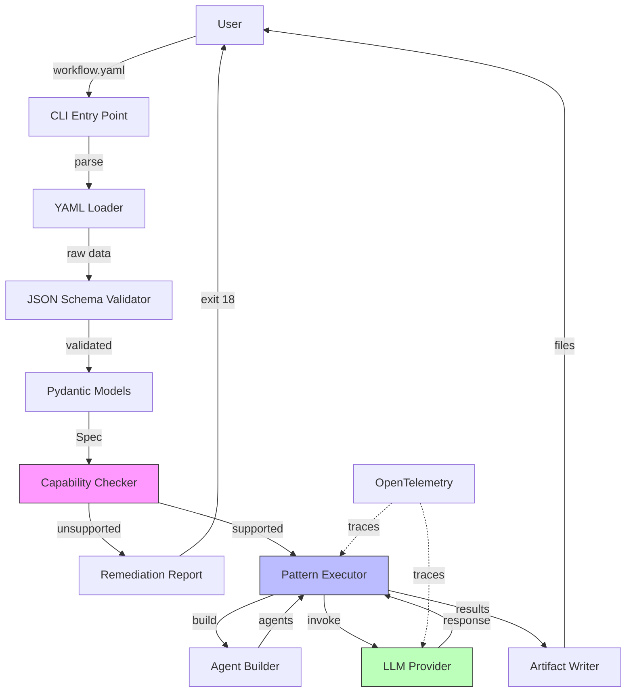
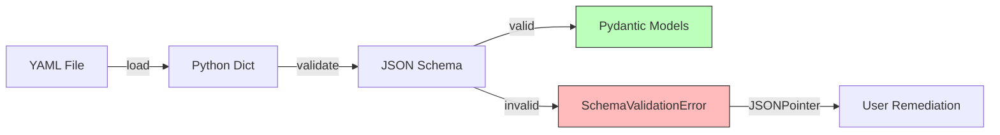
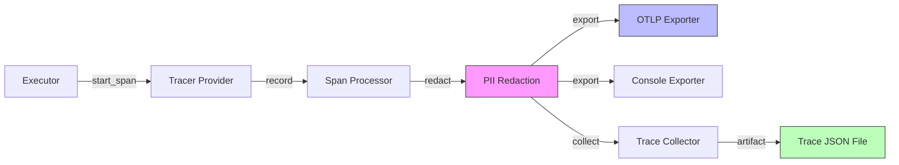
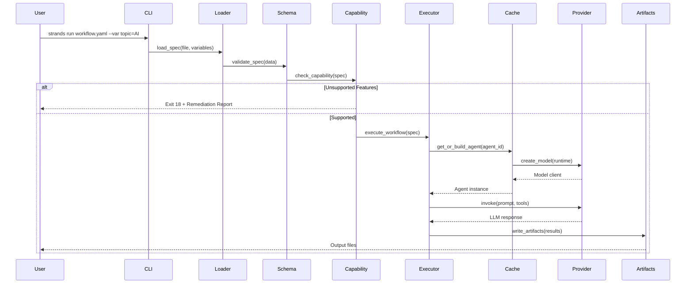
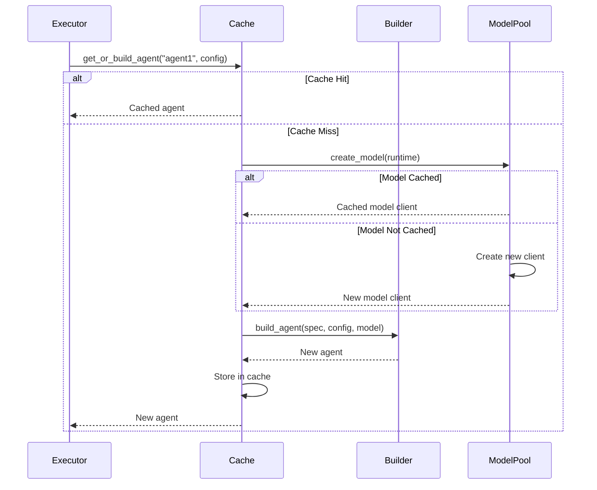
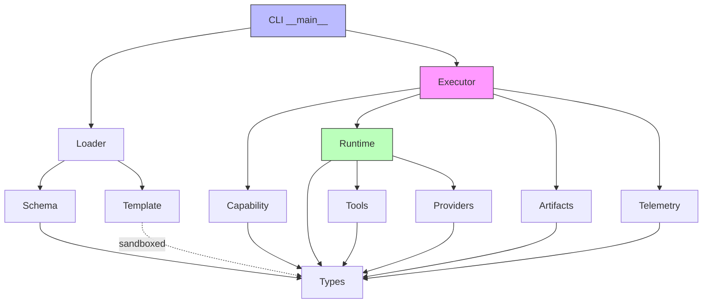
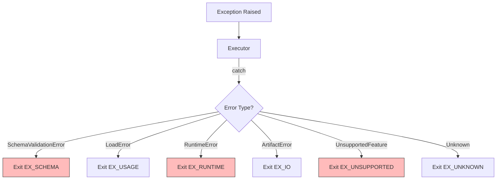

# Architecture Overview

This document explains the high-level architecture of Strands CLI, how components interact, and the execution model used for running agentic workflows.

## System Overview

Strands CLI is a **declarative workflow orchestrator** that executes YAML/JSON workflow specifications using LLM providers (AWS Bedrock, Ollama, OpenAI). It follows a **three-phase execution model**:

1. **Load & Validate**: Parse YAML/JSON → Validate against JSON Schema → Build typed spec
2. **Capability Check**: Evaluate MVP compatibility → Exit gracefully if unsupported features
3. **Execute**: Build agents → Run workflow pattern → Write artifacts



## Core Components

### 1. CLI Layer (`__main__.py`)

**Responsibility**: Command-line interface with 6 commands.

**Commands**:
- `run` - Execute a workflow specification
- `validate` - Validate spec against JSON Schema
- `plan` - Analyze workflow execution plan
- `explain` - Explain workflow structure
- `tools` - List available tools
- `version` - Display version information

**Key Features**:
- Uses Typer for ergonomic CLI with type hints
- Rich console output for pretty formatting
- Structured exit codes (EX_OK, EX_SCHEMA, EX_RUNTIME, etc.)
- Environment variable configuration via Pydantic Settings

**Entry Point**:
```python
@app.command()
def run(
    spec_file: Path,
    var: list[str] | None = None,
    out: Path | None = None,
    force: bool = False,
    verbose: bool = False,
) -> None:
    """Execute a workflow specification."""
    asyncio.run(execute_workflow(spec_file, var, out, force, verbose))
```

### 2. Schema Layer (`schema/`)

**Responsibility**: JSON Schema validation for workflow specs.

**Key Files**:
- `strands-workflow.schema.json` - Complete JSON Schema (Draft 2020-12)
- `validator.py` - Schema validation logic with JSONPointer error reporting

**Validation Process**:


**Features**:
- Statically bundled schema (no external file dependency)
- Precise error reporting with JSONPointer paths
- Comprehensive validation for all workflow properties

### 3. Type System (`types.py`)

**Responsibility**: Pydantic v2 models for all workflow components.

**Key Models**:
- `Spec` - Top-level workflow specification
- `Runtime` - Provider configuration (Bedrock/Ollama/OpenAI)
- `Agent` - Agent configuration with prompt and tools
- `Pattern` - Workflow execution pattern (chain/workflow/routing/etc.)
- `Tools` - Tool configurations (Python/HTTP/MCP)
- `CapabilityReport` - Compatibility analysis results
- `RunResult` - Execution outcome with timing and artifacts

**Type Safety**:
- Python 3.12+ modern type hints (`str | None`, not `Optional[str]`)
- Mypy strict mode enabled
- Pydantic v2 validation with custom validators

### 4. Capability Layer (`capability/`)

**Responsibility**: Check MVP compatibility and generate remediation reports.

**Key Files**:
- `checker.py` - Feature detection and compatibility analysis
- `reporter.py` - Markdown/JSON remediation report generation

**Check Logic**:
```python
def check_capability(spec: Spec) -> CapabilityReport:
    """Check if spec uses only supported MVP features."""
    issues = []
    
    # Check pattern support
    if spec.pattern.type not in SUPPORTED_PATTERNS:
        issues.append(UnsupportedFeature(
            category="pattern",
            feature=spec.pattern.type,
            remediation="Use 'chain', 'workflow', 'routing', 'parallel', ..."
        ))
    
    # Check tool allowlist
    for tool in spec.tools.python:
        if tool.callable not in ALLOWED_PYTHON_CALLABLES:
            issues.append(UnsupportedFeature(...))
    
    return CapabilityReport(supported=(len(issues) == 0), issues=issues)
```

**Exit Strategy**:
- Unsupported features → exit with EX_UNSUPPORTED (18) + remediation report
- Graceful degradation preferred over silent failures

### 5. Loader Layer (`loader/`)

**Responsibility**: Load YAML/JSON and render Jinja2 templates.

**Key Files**:
- `yaml_loader.py` - Load and merge variables
- `template.py` - Sandboxed Jinja2 rendering

**Template Security**:
- Uses `jinja2.sandbox.SandboxedEnvironment`
- Whitelisted filters only: `truncate`, `tojson`, `title`
- Blocks attribute introspection (`__class__`, `__mro__`, etc.)

**Variable Resolution**:
```bash
# CLI usage
strands run workflow.yaml --var topic="AI" --var depth="detailed"
```

```python
# Merges into spec
variables = parse_variables(["topic=AI", "depth=detailed"])
spec = load_spec("workflow.yaml", variables)
```

### 6. Runtime Layer (`runtime/`)

**Responsibility**: Build agents, manage providers, and handle tools.

**Key Files**:
- `providers.py` - Bedrock/Ollama/OpenAI client adapters
- `strands_adapter.py` - Map Spec → Strands Agent
- `tools.py` - Safe tool adapters with allowlisting

**Agent Caching**:
```python
class AgentCache:
    """Singleton cache for agent reuse across workflow execution."""
    
    def __init__(self):
        self._agents: dict[tuple, Agent] = {}
        self._clients: list[Any] = []
    
    async def get_or_build_agent(
        self, spec: Spec, agent_id: str, config: AgentConfig, ...
    ) -> Agent:
        """Get cached agent or build new one."""
        cache_key = (agent_id, config_hash)
        if cache_key in self._agents:
            return self._agents[cache_key]  # Cache hit
        
        agent = await build_agent(spec, agent_id, config, ...)
        self._agents[cache_key] = agent
        return agent
    
    async def close(self):
        """Cleanup all HTTP clients."""
        for client in self._clients:
            await client.close()
```

**Model Client Pooling**:
```python
@dataclass(frozen=True)
class RuntimeConfig:
    """Hashable runtime configuration for LRU cache."""
    provider: str
    model_id: str
    region: str | None = None

@lru_cache(maxsize=16)
def _create_model_cached(config: RuntimeConfig) -> Model:
    """Create and cache model clients."""
    if config.provider == "bedrock":
        return BedrockModel(model_id=config.model_id, region=config.region)
    elif config.provider == "ollama":
        return OllamaModel(model_id=config.model_id, host=config.host)
    # ...
```

### 7. Executor Layer (`exec/`)

**Responsibility**: Execute workflow patterns with async concurrency.

**Pattern Executors**:
- `single_agent.py` - Single-step execution
- `chain.py` - Sequential multi-step execution
- `workflow.py` - DAG-based parallel task execution
- `routing.py` - Dynamic agent selection
- `parallel.py` - Concurrent branch execution
- `evaluator_optimizer.py` - Iterative refinement
- `orchestrator.py` - Dynamic task delegation
- `graph.py` - State machine with conditional transitions

**Async Pattern** (CRITICAL):
```python
# All executors are async functions
async def run_chain(spec: Spec, variables: dict[str, Any]) -> RunResult:
    """Execute chain pattern workflow."""
    cache = AgentCache()  # Create cache
    try:
        for step in spec.pattern.config.steps:
            # Get or build agent (reuses cached agents)
            agent = await cache.get_or_build_agent(...)
            
            # Direct await (not asyncio.run)
            result = await invoke_agent_with_retry(agent, prompt, ...)
        
        return RunResult(...)
    finally:
        await cache.close()  # Cleanup

# CLI calls with single event loop
result = asyncio.run(run_chain(spec, variables))
```

**Key Principles**:
- ✅ Use `async def` for all executor functions
- ✅ Create `AgentCache` at start, use throughout, close in finally
- ✅ Use `await` for agent invocations (not nested `asyncio.run()`)
- ❌ Never call `asyncio.run()` inside an executor (only in CLI)

### 8. Telemetry Layer (`telemetry/`)

**Responsibility**: OpenTelemetry tracing, PII redaction, and debug logging.

**Key Files**:
- `otel.py` - OTEL setup with OTLP/Console exporters
- `redaction.py` - PII pattern detection and redaction

**Tracing Architecture**:


**Span Coverage**:
- `workflow.validate` - Schema validation
- `workflow.execute` - Full workflow execution
- `pattern.<type>` - Pattern-specific execution
- `agent.invoke` - LLM invocation
- `tool.<name>` - Tool execution

### 9. Artifacts Layer (`artifacts/`)

**Responsibility**: Write output files with security checks.

**Key Files**:
- `io.py` - Artifact writing with path validation

**Security Layers**:
1. Reject absolute paths
2. Block path traversal (`..` components)
3. Sanitize path components (remove special chars)
4. Validate resolved path (prevent symlink escape)
5. Block symlinks (MVP restriction)

## Data Flow

### Critical Path: Run Command



### Agent Caching Flow



## Execution Model

### Single Event Loop

**Design Principle**: One `asyncio.run()` per workflow from CLI; executors use `await`.

**Benefits**:
- Clean resource management (single cleanup point)
- Proper async context propagation
- No nested event loop issues
- Efficient concurrency with semaphores

**Implementation**:
```python
# CLI layer (single event loop)
@app.command()
def run(spec_file: Path, ...) -> None:
    result = asyncio.run(execute_workflow(spec_file))  # Single entry point
    sys.exit(EX_OK if result.success else EX_RUNTIME)

# Executor layer (uses await)
async def execute_workflow(spec_file: Path) -> RunResult:
    spec = load_spec(spec_file)
    
    # Route to pattern executor
    if spec.pattern.type == "chain":
        return await run_chain(spec, variables)  # await, not asyncio.run()
    elif spec.pattern.type == "workflow":
        return await run_workflow(spec, variables)
    # ...
```

### Concurrency Control

**Semaphore-Based Limits**:
```python
# Parallel pattern with max_parallel control
max_parallel = spec.runtime.max_parallel or 5
semaphore = asyncio.Semaphore(max_parallel)

async def run_branch_with_limit(branch):
    async with semaphore:  # Acquire slot
        return await run_branch(branch)  # Execute

# Run all branches concurrently with limit
results = await asyncio.gather(
    *[run_branch_with_limit(b) for b in branches],
    return_exceptions=False  # Fail-fast
)
```

### Fail-Fast Semantics

**Design Choice**: Cancel all tasks on first failure.

**Rationale**:
- Predictable error handling
- Fast feedback for users
- Resource conservation (don't waste tokens on doomed workflows)

**Implementation**:
```python
# asyncio.gather with return_exceptions=False
results = await asyncio.gather(*tasks, return_exceptions=False)
# First exception cancels all pending tasks automatically
```

## Module Boundaries

### Dependency Graph



### Separation of Concerns

| Layer | Responsibility | No Access To |
|-------|----------------|--------------|
| CLI | Command parsing, console output | Executor internals |
| Schema | JSON Schema validation | Runtime providers |
| Loader | YAML parsing, template rendering | Executor logic |
| Capability | Feature detection, remediation | Executor logic |
| Runtime | Agent building, provider adapters | Executor patterns |
| Executor | Pattern orchestration, async control | Provider details |
| Telemetry | Tracing, redaction, logging | Business logic |
| Artifacts | File writing, path validation | Executor patterns |

## Performance Characteristics

### Agent Cache Benefits

**Scenario**: 10-step chain with same agent config

- **Without caching**: 10 agent builds + 10 model client creations = 20 operations
- **With caching**: 1 agent build + 1 model client creation = 2 operations
- **Speedup**: ~10x reduction in initialization overhead

### Model Client Pooling

**Scenario**: 100 tasks in workflow, 5 unique runtime configs

- **Without pooling**: 100 model client creations
- **With pooling**: 5 model client creations (cached via `@lru_cache`)
- **Speedup**: ~20x reduction in client creation overhead

### Async Concurrency

**Scenario**: Parallel pattern with 5 branches, max_parallel=3

- **Sequential**: Branch 1 → 2 → 3 → 4 → 5 (sum of all durations)
- **Concurrent**: Max 3 at a time, overlapping execution
- **Speedup**: ~1.67x (depends on branch duration variance)

## Configuration

### Environment Variables

All configuration via Pydantic Settings with env prefix `STRANDS_`:

| Variable | Purpose | Default |
|----------|---------|---------|
| `STRANDS_AWS_REGION` | Bedrock region | `us-east-1` |
| `STRANDS_BEDROCK_MODEL_ID` | Default Bedrock model | `anthropic.claude-3-sonnet-20240229-v1:0` |
| `STRANDS_OLLAMA_HOST` | Ollama server URL | `http://localhost:11434` |
| `STRANDS_OPENAI_API_KEY` | OpenAI API key | None (required for OpenAI) |
| `STRANDS_LOG_LEVEL` | Logging level | `INFO` |
| `STRANDS_LOG_FORMAT` | Log format | `console` (or `json`) |
| `STRANDS_HTTP_BLOCKED_PATTERNS` | Additional URL blocklist | `[]` |
| `STRANDS_HTTP_ALLOWED_DOMAINS` | URL allowlist (strict) | None |
| `STRANDS_OTEL_ENABLED` | Enable OpenTelemetry | `false` |
| `STRANDS_OTEL_ENDPOINT` | OTLP endpoint | `http://localhost:4318` |
| `STRANDS_DEBUG` | Debug mode | `false` |

### Runtime Overrides

Spec file can override runtime defaults:

```yaml
runtime:
  provider: bedrock
  model_id: anthropic.claude-3-haiku-20240307-v1:0  # Override default
  region: us-west-2  # Override default
  budgets:
    tokens: 100000  # Per-workflow limit
  max_parallel: 10  # Concurrency limit
```

## Error Handling

### Exit Code Strategy

**Principle**: Never use generic `exit(1)` - always use named constants.

| Code | Name | Usage |
|------|------|-------|
| 0 | `EX_OK` | Success |
| 2 | `EX_USAGE` | Bad CLI flags/missing file |
| 3 | `EX_SCHEMA` | JSON Schema validation error |
| 10 | `EX_RUNTIME` | Provider/model/tool runtime failure |
| 12 | `EX_IO` | Artifact write/IO error |
| 18 | `EX_UNSUPPORTED` | Feature present but not supported |
| 70 | `EX_UNKNOWN` | Unexpected exception |

**Implementation**:
```python
from strands_cli.exit_codes import EX_SCHEMA, EX_OK

try:
    validate_spec(spec_data)
except SchemaValidationError as e:
    console.print(f"[red]Schema Error:[/red] {e}")
    sys.exit(EX_SCHEMA)  # NOT sys.exit(3)
```

### Error Propagation



## Testing Strategy

### Test Organization

```
tests/
├── conftest.py              # Shared fixtures
├── test_schema.py           # Schema validation
├── test_loader.py           # YAML loading, template rendering
├── test_capability.py       # Feature detection
├── test_runtime.py          # Agent building, provider adapters
├── test_executor.py         # Pattern executors (unit tests)
├── test_integration.py      # End-to-end workflows
├── test_telemetry.py        # OpenTelemetry tracing
└── fixtures/
    ├── valid/               # Valid workflow specs
    └── invalid/             # Schema violations
```

### Coverage Requirements

- **Overall**: ≥85% (current: 82% due to Phase 10 telemetry code)
- **Core modules**: ≥90% (executor, runtime, schema)
- **Integration tests**: ≥60% of E2E scenarios

### Test Execution

```powershell
# Full test suite
.\scripts\dev.ps1 test

# With coverage report
.\scripts\dev.ps1 test-cov

# Specific module
uv run pytest tests/test_executor.py -v

# CI pipeline (lint + typecheck + test)
.\scripts\dev.ps1 ci
```

## Summary

Strands CLI architecture follows these key principles:

1. **Schema-Driven**: All features validated by JSON Schema before execution
2. **Type-Safe**: Pydantic v2 models with mypy strict mode
3. **Async-First**: Single event loop per workflow with proper resource management
4. **Cached & Pooled**: Agent caching and model client pooling for performance
5. **Fail-Fast**: Clear error messages and structured exit codes
6. **Observable**: OpenTelemetry tracing with PII redaction
7. **Secure**: Multi-layer security for templates, HTTP, paths, and tools

**Next Steps**: See [Pattern Philosophy](patterns.md), [Design Decisions](design-decisions.md), [Performance Optimizations](performance.md), and [Security Model](security-model.md) for deeper dives into specific aspects.
