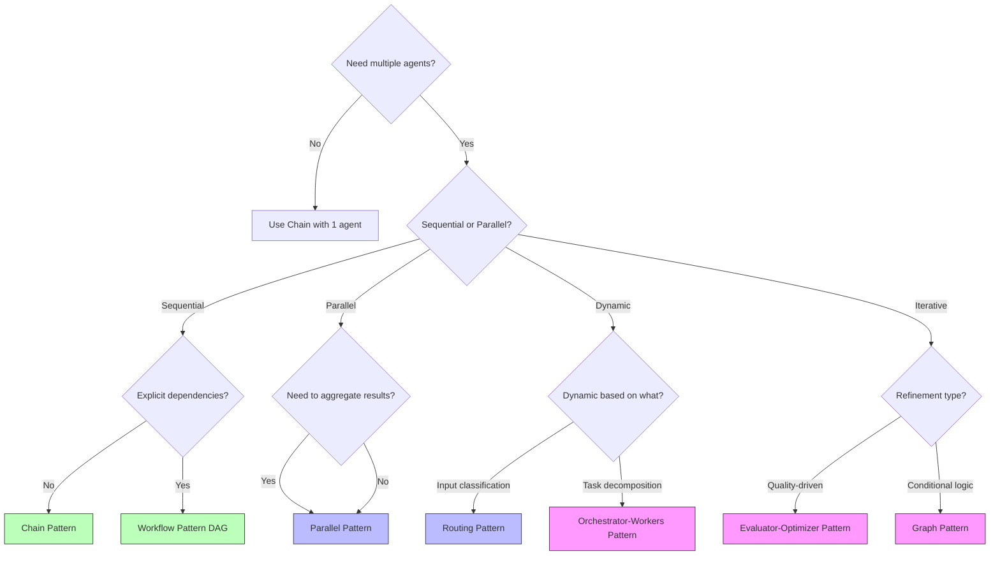

# Pattern Philosophy

This document explains the conceptual foundation of workflow patterns in Strands CLI, why they exist, when to use each, and how to choose the right pattern for your use case.

## Why Patterns?

### The Multi-Agent Orchestration Problem

When building agentic workflows, you quickly encounter several challenges:

1. **Context Threading**: How do agents share information across steps?
2. **Parallel Execution**: How do you run multiple agents concurrently?
3. **Dynamic Routing**: How do you choose different agents based on input?
4. **Quality Control**: How do you iteratively refine outputs?
5. **Task Decomposition**: How do you break complex tasks into subtasks?
6. **Conditional Logic**: How do you implement branching and loops?

### The Pattern Solution

Rather than forcing users to write custom orchestration code, Strands CLI provides **pre-built workflow patterns** that solve common orchestration problems declaratively.

**Benefits**:
- **Declarative**: Describe *what* you want, not *how* to implement it
- **Tested**: Patterns are extensively tested (795 tests, 82% coverage)
- **Observable**: Built-in OpenTelemetry tracing for all patterns
- **Secure**: Security controls (SSRF, path traversal, template sandboxing) apply uniformly
- **Composable**: Patterns can be nested and combined (e.g., parallel branches with chain steps)

**Design Principle**: *Patterns encode best practices for common orchestration scenarios.*

## Pattern Catalog

Strands CLI supports **7 workflow patterns**, each optimized for specific use cases:

### 1. Chain Pattern

**Purpose**: Sequential multi-step execution with context threading.

**When to Use**:
- Linear workflows where each step depends on the previous one
- Research → Analysis → Writing pipelines
- Data extraction → Transformation → Summary flows
- Simple question → follow-up → synthesis scenarios

**Key Features**:
- Steps execute sequentially (step N+1 waits for step N)
- Context accessible via `{{ steps[n].response }}`
- Single agent or different agents per step
- Token budgets accumulate across steps

**Example Use Cases**:
- Web research → extract key points → write blog post
- Read logs → identify patterns → generate report
- Fetch data → analyze trends → create visualization

**Template Access**:
```yaml
steps:
  - agent: researcher
    input: "Research {{ topic }}"
  - agent: analyst
    input: "Analyze findings: {{ steps[0].response }}"
  - agent: writer
    input: "Write report based on: {{ steps[1].response }}"
```

**Trade-offs**:
- ✅ Simple to understand and debug
- ✅ Predictable execution order
- ❌ No parallelism (slower for independent tasks)
- ❌ Failure in step N blocks all subsequent steps

---

### 2. Workflow Pattern (DAG)

**Purpose**: DAG-based multi-task execution with dependency resolution.

**When to Use**:
- Tasks with explicit dependencies that can run in parallel
- Fan-out/fan-in patterns (one task → many → one)
- Complex pipelines where some tasks are independent
- Workflows requiring topological sorting

**Key Features**:
- Tasks with `depends_on: [task_ids]` specify dependencies
- Parallel execution of independent tasks (respects `max_parallel`)
- Context accessible via `{{ tasks.<id>.response }}`
- Detects dependency cycles at validation time

**Example Use Cases**:
- Parallel data collection from multiple sources → merge results
- Independent analysis tasks → aggregation step
- Validation tasks that can run concurrently → final approval

**Template Access**:
```yaml
tasks:
  - id: fetch_web
    agent: scraper
    input: "Fetch web data"
  - id: fetch_db
    agent: db_query
    input: "Fetch database data"
  - id: merge
    agent: synthesizer
    depends_on: [fetch_web, fetch_db]
    input: "Merge {{ tasks.fetch_web.response }} and {{ tasks.fetch_db.response }}"
```

**Trade-offs**:
- ✅ Parallel execution speeds up independent tasks
- ✅ Flexible dependency specification
- ✅ Topological sorting handled automatically
- ❌ More complex to reason about than chain
- ❌ Dependency cycles cause validation errors

---

### 3. Routing Pattern

**Purpose**: Dynamic agent selection based on classifier decisions.

**When to Use**:
- Different agents specialized for different input types
- Customer support routing (technical/billing/general)
- Multi-domain question answering (code/docs/general)
- Intent-based delegation

**Key Features**:
- Router agent classifies input and selects target agent
- Retry logic for malformed JSON (up to 2 retries)
- Context accessible via `{{ router.response }}` and `{{ last_response }}`
- Supports custom routing prompt templates

**Example Use Cases**:
- Customer support: Route to technical/billing/sales agents
- Code assistance: Route to Python/JavaScript/SQL experts
- Document analysis: Route to legal/financial/technical analysts

**Template Access**:
```yaml
pattern:
  type: routing
  config:
    router:
      agent: classifier
      input: "Classify intent: {{ user_question }}"
    routes:
      - route_id: technical
        agent: tech_support
        input: "Answer technical question: {{ user_question }}"
      - route_id: billing
        agent: billing_support
        input: "Answer billing question: {{ user_question }}"
```

**Trade-offs**:
- ✅ Dynamic agent selection based on input
- ✅ Scales to many specialized agents
- ✅ Router retry handles LLM inconsistency
- ❌ Adds latency (router invocation before task)
- ❌ Requires router agent to output valid JSON

---

### 4. Parallel Pattern

**Purpose**: Concurrent branch execution with optional reduce aggregation.

**When to Use**:
- Independent analyses that can run concurrently
- A/B testing multiple approaches
- Multi-perspective evaluation (expert reviews)
- Parallel data processing pipelines

**Key Features**:
- Branches execute concurrently (respects `max_parallel`)
- Optional reduce step aggregates all branch results
- Context accessible via `{{ branches.<id>.response }}`
- Fail-fast semantics (first failure cancels all branches)

**Example Use Cases**:
- Parallel web scraping from multiple sources
- Multiple LLM providers for consensus
- Parallel code review from different perspectives
- Regional data collection (US/EU/APAC)

**Template Access**:
```yaml
pattern:
  type: parallel
  config:
    branches:
      - id: web
        steps: [...]
      - id: api
        steps: [...]
    reduce:
      agent: synthesizer
      input: |
        Web results: {{ branches.web.response }}
        API results: {{ branches.api.response }}
        Merge and summarize.
```

**Trade-offs**:
- ✅ Maximum parallelism for independent tasks
- ✅ Optional reduce step for aggregation
- ✅ Semaphore control prevents resource exhaustion
- ❌ No inter-branch communication (branches are isolated)
- ❌ Fail-fast means one failure aborts all branches

---

### 5. Evaluator-Optimizer Pattern

**Purpose**: Iterative refinement with producer-evaluator feedback loops.

**When to Use**:
- Quality-driven content generation (writing, code)
- Iterative improvement until quality threshold met
- Self-correcting workflows with evaluation criteria
- Research → refine → finalize loops

**Key Features**:
- Producer generates output, evaluator scores it
- Retry with feedback if score below `min_score`
- Max iterations (`max_iters`) prevents infinite loops
- Context accessible via `{{ iterations[n].producer }}` and `{{ iterations[n].evaluator }}`

**Example Use Cases**:
- Code generation with test-based evaluation
- Blog post writing with quality scoring
- Research synthesis with completeness checks
- Design iteration with stakeholder feedback

**Template Access**:
```yaml
pattern:
  type: evaluator_optimizer
  config:
    producer:
      agent: writer
      input: "Write about {{ topic }}"
    evaluator:
      agent: critic
      input: "Rate this (1-10): {{ last_produced }}"
    min_score: 8
    max_iters: 3
```

**Trade-offs**:
- ✅ Quality gates ensure output meets standards
- ✅ Automatic refinement with feedback
- ✅ Configurable acceptance criteria
- ❌ Can consume many tokens if quality threshold is high
- ❌ Evaluator must return valid JSON with score

---

### 6. Orchestrator-Workers Pattern

**Purpose**: Dynamic task delegation with orchestrator decomposing tasks and workers executing in parallel.

**When to Use**:
- Complex tasks requiring decomposition
- Variable number of subtasks determined at runtime
- Swarm intelligence scenarios
- Hierarchical task planning

**Key Features**:
- Orchestrator decomposes task into worker assignments (JSON)
- Workers execute in parallel (respects `max_workers`)
- Multi-round delegation supported (`max_rounds`)
- Optional reduce and writeup steps
- Context accessible via `{{ rounds[n].workers[m].response }}`

**Example Use Cases**:
- Research swarm (orchestrator assigns topics, workers research)
- Data processing pipeline (orchestrator plans, workers execute)
- Code review (orchestrator identifies concerns, workers analyze)
- Multi-document summarization (orchestrator assigns docs, workers summarize)

**Template Access**:
```yaml
pattern:
  type: orchestrator_workers
  config:
    orchestrator:
      agent: planner
      limits:
        max_workers: 5
        max_rounds: 2
    worker_template:
      agent: researcher
      tools: ["http_executors"]
    reduce:
      agent: synthesizer
      input: "Merge results: {{ w.response }}"
    writeup:
      agent: writer
      input: "Final report based on: {{ reduce_result }}"
```

**Trade-offs**:
- ✅ Dynamic task decomposition at runtime
- ✅ Scales to variable workloads
- ✅ Multi-round delegation for iterative planning
- ✅ Optional reduce/writeup for final synthesis
- ❌ Complex to debug (orchestrator JSON must be valid)
- ❌ High token usage for large worker pools

---

### 7. Graph Pattern

**Purpose**: State machine with conditional transitions between nodes.

**When to Use**:
- Workflows with branching logic and loops
- Decision trees and flowcharts
- Multi-stage processes with conditional paths
- Iterative refinement with break conditions

**Key Features**:
- Nodes connected by conditional or default edges
- Secure `when` clause evaluation (restricted builtins)
- Cycle detection with `max_iterations` protection
- Context accessible via `{{ nodes.<id>.response }}`
- Static and dynamic transitions

**Example Use Cases**:
- Content approval workflow (draft → review → approve/reject → revise → ...)
- Iterative problem solving (attempt → validate → retry if failed → success)
- Decision trees (classify → route → process → verify → done)
- State-based workflows (idle → active → paused → resumed → completed)

**Template Access**:
```yaml
pattern:
  type: graph
  config:
    start_node: draft
    max_iterations: 10
    nodes:
      draft:
        agent: writer
        edges:
          - to: review
      review:
        agent: reviewer
        edges:
          - to: revise
            when: "score < 8"
          - to: done  # Default edge
      revise:
        agent: writer
        edges:
          - to: review
```

**Trade-offs**:
- ✅ Explicit control flow with conditionals
- ✅ Loops and branches supported natively
- ✅ Max iteration protection prevents infinite loops
- ✅ Clear state machine semantics
- ❌ More complex to design than linear patterns
- ❌ Cycle detection adds validation overhead

---

## Pattern Selection Guide

### Decision Tree



### Pattern Comparison Matrix

| Pattern | Parallelism | Dependencies | Dynamic | Loops | Complexity | Token Efficiency |
|---------|-------------|--------------|---------|-------|------------|------------------|
| **Chain** | None | Implicit (sequential) | No | No | Low | High (1 path) |
| **Workflow** | Yes (via DAG) | Explicit (`depends_on`) | No | No | Medium | Medium (parallel) |
| **Routing** | No | None | Yes (input-based) | No | Medium | Medium (1 route) |
| **Parallel** | Yes (all branches) | None | No | No | Medium | Low (all branches) |
| **Evaluator-Optimizer** | No | Implicit (producer→evaluator) | No | Yes (up to max_iters) | Medium | Low (retries) |
| **Orchestrator-Workers** | Yes (workers) | None | Yes (runtime tasks) | Yes (multi-round) | High | Very Low (many workers) |
| **Graph** | No | Explicit (edges) | Yes (conditional) | Yes (cycles) | High | Variable (path-dependent) |

### Use Case Mapping

| Use Case | Recommended Pattern | Alternative |
|----------|---------------------|-------------|
| Linear pipeline (research → analyze → write) | Chain | Workflow (overkill) |
| Parallel data collection → merge | Workflow (with dependencies) | Parallel (with reduce) |
| Customer support routing | Routing | Graph (overkill) |
| Multi-perspective analysis | Parallel | Workflow (if dependencies) |
| Code generation with tests | Evaluator-Optimizer | Graph (more flexible) |
| Research swarm | Orchestrator-Workers | Parallel (if fixed tasks) |
| Approval workflow with revisions | Graph | Evaluator-Optimizer (less flexible) |
| A/B testing multiple approaches | Parallel | Workflow (if dependencies) |
| Iterative problem solving | Graph | Evaluator-Optimizer (if simple) |

## Pattern Composability

### Nested Patterns

Some patterns support nesting (e.g., parallel branches with chain steps):

```yaml
pattern:
  type: parallel
  config:
    branches:
      - id: web
        steps:  # Chain pattern within branch
          - agent: scraper
            input: "Scrape data"
          - agent: parser
            input: "Parse {{ steps[0].response }}"
      - id: api
        steps:
          - agent: api_client
            input: "Fetch API data"
```

### Anti-Patterns

**❌ Don't use parallel for sequential tasks with dependencies**:
```yaml
# BAD: Step 2 needs step 1, but they run in parallel
pattern:
  type: parallel
  config:
    branches:
      - id: step1
        steps: [...]
      - id: step2  # Needs step1 output but can't access it!
        steps: [...]
```
**✅ Use workflow or chain instead**.

**❌ Don't use routing for parallel execution**:
```yaml
# BAD: Router only selects ONE agent, not all
pattern:
  type: routing
  config:
    routes:
      - route_id: all  # Can't execute all routes
        agent: agent1
```
**✅ Use parallel pattern instead**.

**❌ Don't use evaluator-optimizer for multi-perspective evaluation**:
```yaml
# BAD: Evaluator-optimizer is one producer, one evaluator
pattern:
  type: evaluator_optimizer
  config:
    producer: writer
    evaluator: critic  # Only ONE evaluator, not multiple
```
**✅ Use parallel pattern with multiple expert agents**.

## Performance Considerations

### Token Usage

| Pattern | Token Usage | Notes |
|---------|-------------|-------|
| Chain | Linear (N steps) | Most efficient for sequential |
| Workflow | Parallel (sum of concurrent tasks) | Better than chain for independent tasks |
| Routing | Router + 1 route | Efficient if router is simple |
| Parallel | Sum of all branches | Can be expensive with many branches |
| Evaluator-Optimizer | Producer + (Evaluator × iterations) | Can be expensive if many iterations |
| Orchestrator-Workers | Orchestrator + (Workers × rounds) | Most expensive for large worker pools |
| Graph | Path-dependent | Variable based on conditionals |

### Latency

| Pattern | Latency | Notes |
|---------|---------|-------|
| Chain | Sum of step latencies | Sequential (slowest) |
| Workflow | Max latency of parallel tasks | Faster than chain for independent tasks |
| Routing | Router latency + route latency | Extra router overhead |
| Parallel | Max branch latency | Fastest for independent tasks |
| Evaluator-Optimizer | Producer + (Evaluator × iterations) | Can be slow with many iterations |
| Orchestrator-Workers | Orchestrator + max(worker latencies) × rounds | Variable based on decomposition |
| Graph | Path-dependent | Variable based on conditionals |

### Concurrency Control

All patterns respect `runtime.max_parallel` for semaphore-based concurrency control:

```yaml
runtime:
  max_parallel: 5  # Max concurrent tasks/branches/workers
```

**Default**: 5 concurrent operations

**Trade-offs**:
- Higher `max_parallel` → faster execution, higher memory usage
- Lower `max_parallel` → slower execution, lower memory usage

## Pattern Evolution

### Current Support

All 7 patterns are fully implemented and tested:
- ✅ Chain
- ✅ Workflow
- ✅ Routing
- ✅ Parallel
- ✅ Evaluator-Optimizer
- ✅ Orchestrator-Workers
- ✅ Graph

### Future Patterns (Potential)

- **Map-Reduce**: Simplified orchestrator-workers for homogeneous tasks
- **State Machine**: Enhanced graph pattern with explicit state management
- **Event-Driven**: Trigger-based workflows with event subscriptions

### Implemented Features

- ✅ **Human-in-the-Loop (HITL)**: Manual approval gates and interactive steps in chain pattern (See [HITL Guide](../howto/hitl.md))

## Best Practices

### 1. Start Simple

Begin with **chain** or **workflow** patterns for most use cases. Move to advanced patterns only when needed.

### 2. Use Workflow for Parallel Independence

If tasks are independent and can run in parallel, prefer **workflow** over **chain**.

### 3. Routing for Specialization

Use **routing** when different agents are experts in different domains (technical/billing/sales).

### 4. Parallel for Fan-Out

Use **parallel** when you need to run the same analysis from multiple perspectives or sources.

### 5. Evaluator-Optimizer for Quality

Use **evaluator-optimizer** when output quality is critical and iterative refinement is acceptable.

### 6. Orchestrator-Workers for Complex Decomposition

Use **orchestrator-workers** when the number of subtasks is unknown at spec-writing time.

### 7. Graph for Complex Logic

Use **graph** when you need explicit branching, loops, and conditional transitions.

### 8. Monitor Token Budgets

Set `runtime.budgets.tokens` to prevent runaway costs, especially with:
- Evaluator-optimizer (many iterations)
- Orchestrator-workers (large worker pools)
- Graph (potential cycles)

### 9. Use Debug Mode

Enable `--debug` flag to trace execution flow and template rendering:

```bash
strands run workflow.yaml --debug
```

### 10. Test with Simple Cases First

Before running complex workflows, test patterns with simple examples to understand behavior.

## Summary

**Pattern Philosophy**:
- Patterns encode best practices for common orchestration scenarios
- Choose patterns based on task structure (sequential/parallel/dynamic/iterative)
- Start simple (chain/workflow) and move to advanced patterns as needed
- Monitor token usage and latency for complex patterns
- Use debug mode and telemetry to understand execution flow

**Next Steps**: See [Architecture Overview](architecture.md), [Design Decisions](design-decisions.md), [Performance Optimizations](performance.md), and [Security Model](security-model.md) for deeper dives into implementation details.
