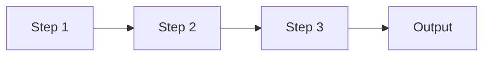

# Building Your First Multi-Step Workflow

This tutorial teaches you how to build powerful multi-step workflows using the **chain pattern**. You'll learn how to pass context between steps, transform data, and create complex AI-driven processes.

## What You'll Learn

- Understanding the chain pattern
- Passing context between workflow steps
- Using template variables and filters
- Accessing previous step results
- Creating structured outputs
- Best practices for multi-step workflows

## Prerequisites

You should have:

- Completed at least one quickstart tutorial ([Ollama](quickstart-ollama.md), [Bedrock](quickstart-bedrock.md), or [OpenAI](quickstart-openai.md))
- Basic understanding of YAML syntax
- Familiarity with Jinja2 template syntax (helpful but not required)

## What is the Chain Pattern?

The **chain pattern** executes multiple steps sequentially, where each step can access the outputs of previous steps. Think of it like a pipeline where data flows from one stage to the next.



**Use cases**:
- Research → Analysis → Summary
- Idea → Outline → Full Article
- Code → Review → Documentation
- Question → Research → Answer

## Step 1: Create a Simple Two-Step Chain

Let's start with a simple workflow that generates content in two steps.

Create `content-chain.yaml`:

```yaml
version: 0
name: content-chain
description: Two-step content generation workflow

runtime:
  provider: ollama  # or openai, bedrock
  model_id: llama3.2  # or gpt-4o-mini, anthropic.claude-3-sonnet...

inputs:
  values:
    topic: "renewable energy"
    format: "blog post"

agents:
  writer:
    prompt: |
      You are a skilled content writer who creates engaging, informative content.
      Write in a clear, accessible style suitable for a general audience.

pattern:
  type: chain
  config:
    steps:
      # Step 1: Generate an outline
      - agent: writer
        input: "Create a detailed outline for a {{ format }} about {{ topic }}. Include 3-5 main points."

      # Step 2: Write full content from outline
      - agent: writer
        input: |
          Use this outline to write a complete {{ format }}:

          {{ last_response }}

          Make it informative, engaging, and approximately 500 words.

outputs:
  artifacts:
    - path: ./{{ topic | replace(' ', '-') }}.md
      from: "{{ last_response }}"
```

### Key Concepts

- **`pattern.type: chain`**: Enables sequential step execution
- **`steps`**: Array of workflow steps (executed in order)
- **`{{ last_response }}`**: References the most recent step's output
- **`{{ topic | replace(' ', '-') }}`**: Jinja2 filter to transform variables

### Run It

```bash
uv run strands run content-chain.yaml
```

You'll see:
1. Step 1 generates an outline
2. Step 2 uses that outline to write full content
3. Final content saved to `renewable-energy.md`

## Step 2: Access Specific Step Results

Instead of just using `last_response`, you can access any previous step by index.

Create `research-chain.yaml`:

```yaml
version: 0
name: research-chain
description: Three-step research workflow with specific step references

runtime:
  provider: openai
  model_id: gpt-4o-mini

inputs:
  values:
    topic: "quantum computing"

agents:
  researcher:
    prompt: |
      You are a research assistant with expertise in technology and science.
      Provide accurate, well-structured information.

pattern:
  type: chain
  config:
    steps:
      # Step 0: Gather key facts
      - agent: researcher
        input: "Research {{ topic }}. List 5 key facts or concepts."

      # Step 1: Deep dive on one aspect
      - agent: researcher
        input: |
          Based on this research:
          {{ steps[0].response }}

          Choose the most interesting fact and explain it in detail.

      # Step 2: Create summary combining both
      - agent: researcher
        input: |
          Using this information:

          Key Facts:
          {{ steps[0].response }}

          Detailed Explanation:
          {{ steps[1].response }}

          Write a 2-paragraph summary for a non-technical audience.

outputs:
  artifacts:
    - path: ./research-report.md
      from: |
        # Research Report: {{ topic }}

        ## Key Facts
        {{ steps[0].response }}

        ## Deep Dive
        {{ steps[1].response }}

        ## Summary
        {{ last_response }}
```

### Key Concepts

- **`steps[0].response`**: Access first step's output (0-indexed)
- **`steps[1].response`**: Access second step's output
- **Multi-line artifact template**: Combine multiple step results

### Run It

```bash
uv run strands run research-chain.yaml
```

The final report includes all three sections with proper formatting.

## Step 3: Use Variables in Steps

Each step can define its own variables to control behavior.

Create `adaptive-chain.yaml`:

```yaml
version: 0
name: adaptive-chain
description: Chain with step-level variables

runtime:
  provider: openai
  model_id: gpt-4o-mini

inputs:
  values:
    product: "smart home thermostat"
    audience: "homeowners"

agents:
  marketer:
    prompt: "You are a professional marketing copywriter."

pattern:
  type: chain
  config:
    steps:
      # Step 1: Generate benefits
      - agent: marketer
        input: "List 3 key benefits of {{ product }} for {{ audience }}."
        vars:
          style: "concise"

      # Step 2: Create tagline
      - agent: marketer
        input: |
          Based on these benefits:
          {{ last_response }}

          Create a memorable tagline (max 10 words).
        vars:
          creativity: "high"

      # Step 3: Write full description
      - agent: marketer
        input: |
          Tagline: {{ steps[1].response }}

          Benefits: {{ steps[0].response }}

          Write a 100-word product description for {{ audience }}.

outputs:
  artifacts:
    - path: ./marketing-copy.md
      from: |
        # {{ product }}

        **Tagline**: {{ steps[1].response }}

        ## Benefits
        {{ steps[0].response }}

        ## Description
        {{ last_response }}
```

### Key Concepts

- **`vars`**: Step-specific variables (available in that step's context)
- **Combining global and local variables**: `{{ product }}` (global) and `{{ style }}` (local)

## Step 4: Advanced Template Filters

Jinja2 provides powerful filters for transforming data.

Create `filtered-chain.yaml`:

```yaml
version: 0
name: filtered-chain
description: Using Jinja2 filters in workflows

runtime:
  provider: openai
  model_id: gpt-4o-mini

inputs:
  values:
    topic: "climate change impacts"

agents:
  analyst:
    prompt: "You are a data analyst and science communicator."

pattern:
  type: chain
  config:
    steps:
      # Step 1: Generate long-form analysis
      - agent: analyst
        input: "Provide a comprehensive analysis of {{ topic }}. Be detailed and thorough."

      # Step 2: Create executive summary
      - agent: analyst
        input: |
          Full analysis (first 500 chars):
          {{ steps[0].response | truncate(500) }}

          Create a 3-bullet executive summary of the key takeaways.

      # Step 3: Generate tweet
      - agent: analyst
        input: |
          Analysis: {{ steps[0].response | truncate(200) }}

          Summary: {{ steps[1].response }}

          Write a Twitter thread (3 tweets, 280 chars each) explaining {{ topic }}.

outputs:
  artifacts:
    - path: ./{{ topic | replace(' ', '_') | lower }}_analysis.md
      from: |
        # {{ topic | title }}

        ## Full Analysis
        {{ steps[0].response }}

        ## Executive Summary
        {{ steps[1].response }}

        ## Social Media (Twitter Thread)
        {{ last_response }}
```

### Common Jinja2 Filters

| Filter | Example | Result |
|--------|---------|--------|
| `truncate(n)` | `{{ text \| truncate(100) }}` | First 100 chars + "..." |
| `lower` | `{{ "HELLO" \| lower }}` | "hello" |
| `upper` | `{{ "hello" \| upper }}` | "HELLO" |
| `title` | `{{ "hello world" \| title }}` | "Hello World" |
| `replace(old, new)` | `{{ "a b" \| replace(' ', '-') }}` | "a-b" |
| `trim` | `{{ "  text  " \| trim }}` | "text" |

## Step 5: Error Handling and Debugging

When building complex chains, debugging is important.

### Enable Debug Mode

```bash
uv run strands run workflow.yaml --debug --verbose
```

This shows:
- Each step's input before execution
- Each step's output after execution
- Token usage per step
- Timing information

### Validate Before Running

```bash
uv run strands validate workflow.yaml
```

Catches:
- YAML syntax errors
- Missing required fields
- Invalid template syntax
- Type mismatches

### Common Errors and Solutions

**Error**: `TemplateSyntaxError: unexpected '}'`

**Solution**: Check Jinja2 syntax - use `{{ variable }}` not `{variable}`

---

**Error**: `KeyError: 'steps'`

**Solution**: `steps[n].response` only works in chain pattern, not single_agent

---

**Error**: `IndexError: list index out of range`

**Solution**: Can't access `steps[2]` from step 1 - only previous steps available

## Step 6: Real-World Example - Blog Post Generator

Let's create a practical workflow that generates a complete blog post.

Create `blog-generator.yaml`:

```yaml
version: 0
name: blog-generator
description: Complete blog post generation workflow

runtime:
  provider: openai
  model_id: gpt-4o-mini
  temperature: 0.7
  max_tokens: 8000

inputs:
  values:
    topic: "productivity tips for remote workers"
    target_words: 800
    tone: "friendly and practical"

agents:
  content_creator:
    prompt: |
      You are a professional content creator and blogger.
      Write in a {{ tone }} style.
      Use clear headings, bullet points, and examples.

pattern:
  type: chain
  config:
    steps:
      # Step 1: Research and brainstorm
      - agent: content_creator
        input: |
          Brainstorm ideas for a blog post about: {{ topic }}

          Provide:
          - 3 potential titles
          - 5 main points to cover
          - 3 relevant examples or stories

      # Step 2: Create outline
      - agent: content_creator
        input: |
          Using these ideas:
          {{ last_response }}

          Create a detailed outline for a {{ target_words }}-word blog post.
          Include:
          - Introduction hook
          - 3-5 main sections with subsections
          - Conclusion with call-to-action

      # Step 3: Write full article
      - agent: content_creator
        input: |
          Write a complete blog post following this outline:

          {{ last_response }}

          Requirements:
          - Target length: {{ target_words }} words
          - Tone: {{ tone }}
          - Use markdown formatting
          - Include practical examples

      # Step 4: Generate SEO metadata
      - agent: content_creator
        input: |
          For this blog post:
          {{ steps[2].response | truncate(500) }}

          Generate:
          - SEO title (60 chars max)
          - Meta description (155 chars max)
          - 5 relevant keywords

outputs:
  artifacts:
    - path: ./blog-posts/{{ topic | replace(' ', '-') | lower }}.md
      from: |
        ---
        title: "{{ topic | title }}"
        date: "{{ now }}"
        keywords: {{ steps[3].response }}
        ---

        {{ steps[2].response }}

        ---

        ## SEO Metadata
        {{ steps[3].response }}
```

### Run the Blog Generator

```bash
uv run strands run blog-generator.yaml
```

Or customize it:

```bash
uv run strands run blog-generator.yaml \
  --var topic="healthy eating on a budget" \
  --var target_words=1200 \
  --var tone="authoritative yet approachable"
```

## Best Practices for Multi-Step Workflows

### 1. Keep Steps Focused

Each step should have a clear, single purpose.

```yaml
# Good: Clear, focused steps
steps:
  - agent: writer
    input: "Create outline for {{ topic }}"
  - agent: writer
    input: "Write introduction based on: {{ last_response }}"

# Bad: Too much in one step
steps:
  - agent: writer
    input: "Create outline, write introduction, and draft conclusion for {{ topic }}"
```

### 2. Use Descriptive Step Names (via comments)

```yaml
steps:
  # Step 0: Research phase
  - agent: researcher
    input: "Research {{ topic }}"

  # Step 1: Analysis phase
  - agent: analyst
    input: "Analyze: {{ steps[0].response }}"
```

### 3. Truncate Long Context

Avoid passing massive text between steps:

```yaml
# Good: Truncate to relevant portion
input: "Summarize: {{ steps[0].response | truncate(1000) }}"

# Bad: Can hit token limits
input: "Summarize: {{ steps[0].response }}"
```

### 4. Test Incrementally

Build chains one step at a time:

```bash
# Test with just first step
strands run workflow.yaml

# Add second step, test again
# Add third step, test again
```

### 5. Use Variables for Reusability

```yaml
inputs:
  values:
    provider: "openai"
    model: "gpt-4o-mini"
    topic: "machine learning"

runtime:
  provider: "{{ provider }}"
  model_id: "{{ model }}"
```

## Next Steps

You now understand multi-step workflows! Explore more advanced patterns:

1. **Workflow Pattern**: Parallel task execution with dependencies ([How-to Guide](../howto/patterns/workflow.md))
2. **Routing Pattern**: Dynamic agent selection ([How-to Guide](../howto/patterns/routing.md))
3. **Evaluator-Optimizer**: Iterative refinement ([How-to Guide](../howto/patterns/evaluator-optimizer.md))
4. **Graph Pattern**: Complex control flow with loops ([How-to Guide](../howto/patterns/graph.md))

## Key Concepts Recap

| Concept | Description | Example |
|---------|-------------|---------|
| **Chain Pattern** | Sequential step execution | `pattern.type: chain` |
| **`last_response`** | Most recent step output | `{{ last_response }}` |
| **`steps[n].response`** | Specific step output (0-indexed) | `{{ steps[0].response }}` |
| **Template Filters** | Transform variables | `{{ text \| truncate(100) }}` |
| **Step Variables** | Local vars for specific step | `vars: {style: "formal"}` |
| **Multi-line Templates** | Combine multiple outputs | `from: \|` (literal block) |

## Common Commands

```bash
# Validate workflow
strands validate workflow.yaml

# Run workflow
strands run workflow.yaml

# Run with overrides
strands run workflow.yaml --var topic="AI ethics"

# Debug mode
strands run workflow.yaml --debug --verbose

# Preview without execution
strands plan workflow.yaml
```

## Template Variable Reference

| Variable | Description | Available In |
|----------|-------------|--------------|
| `{{ last_response }}` | Most recent step output | All steps after first |
| `{{ steps[n].response }}` | Specific step output | Steps after step n |
| `{{ inputs.variable }}` | Input variable | All steps |
| `{{ now }}` | Current timestamp | All contexts |

## Further Reading

- [Chain Pattern Reference](../howto/patterns/chain.md) - Complete chain pattern guide
- [Template Variables](../reference/schema.md#template-variables) - Full variable reference
- [Jinja2 Filters](https://jinja.palletsprojects.com/en/3.1.x/templates/#builtin-filters) - Complete filter list
- [Pattern Comparison](../explanation/patterns.md) - When to use each pattern
- [Context Management](../howto/context-management.md) - Managing token budgets
